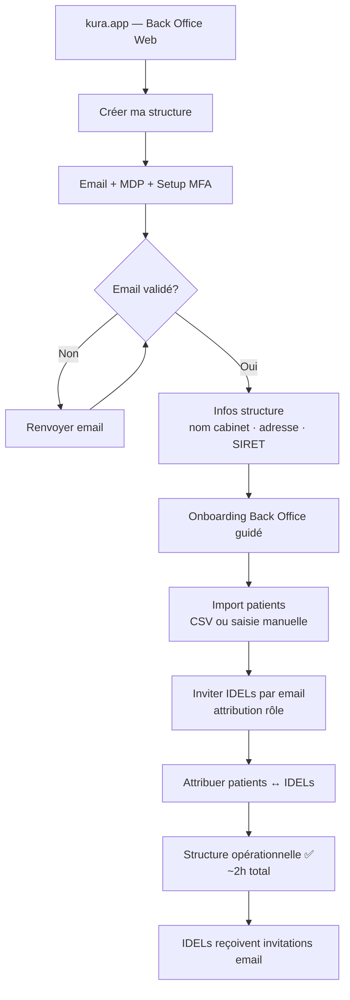
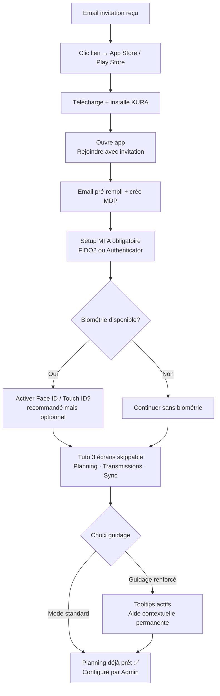
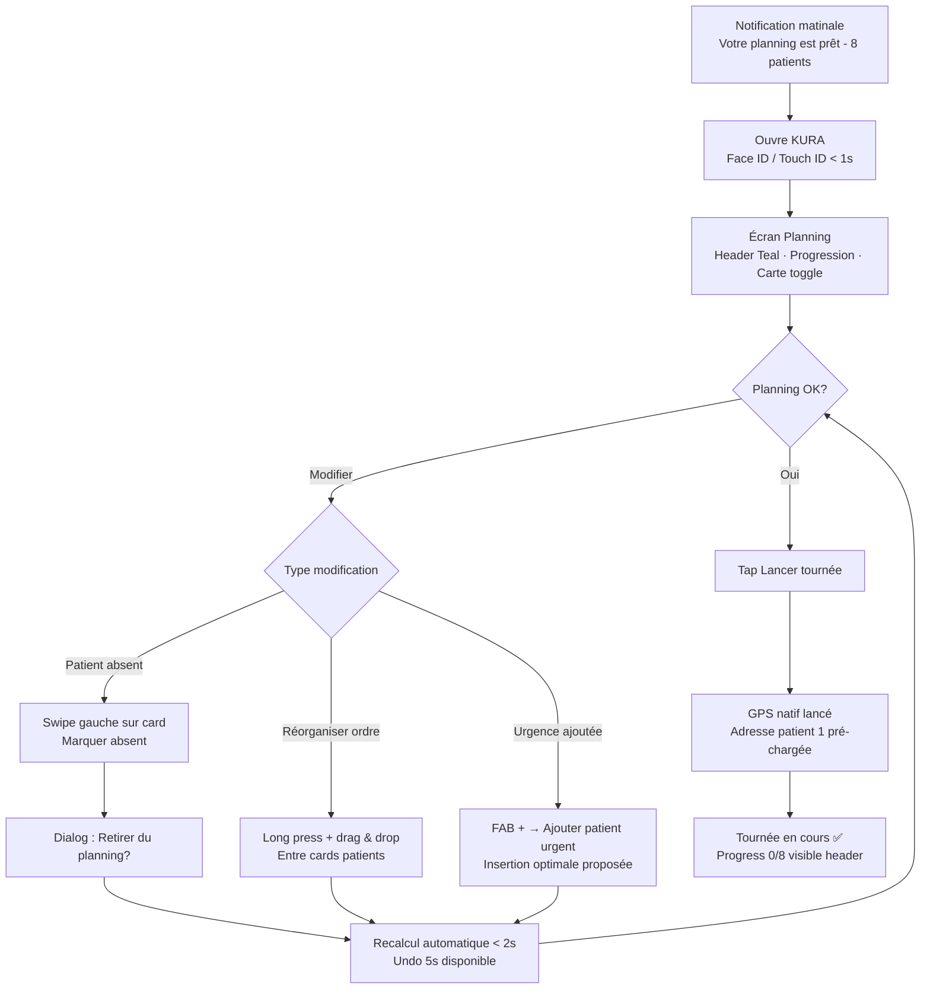
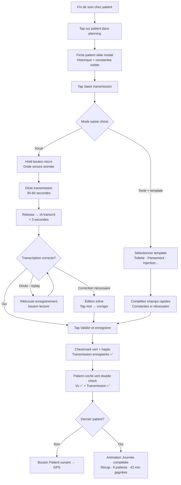
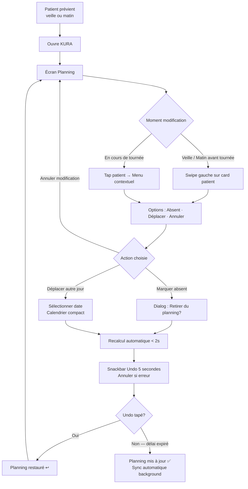

# UX Design Specification - idel-app (KURA)

**Author:** Potpot
**Date:** 2026-01-21

---

## Executive Summary

### Project Vision

KURA (idel-app) est une application mobile healthcare offline-first conçue pour transformer le quotidien des 120 000+ infirmiers libéraux (IDEL) en France. L'objectif UX central est de **faire gagner 30+ minutes par jour** en simplifiant deux tâches critiques : l'organisation des tournées (planning intelligent IA) et la saisie des transmissions (vocale + templates).

**Philosophie UX** : IA assistante qui suggère, jamais décide - l'utilisateur garde 100% du contrôle.

**Plateformes** : Application mobile native cross-platform (React Native/Expo) iOS + Android + Back Office web desktop.

### Target Users

**Utilisateurs Primaires (IDEL) :**

**👤 Marie (80%) - L'Expérimentée** : Modérément tech, iPhone, adopte si gain temps visible
- **Pain UX** : Jongle entre 3 outils (charge mentale), transmissions chronophages le soir
- **Besoin UX** : Interface unifiée rapide, optimisation planning visible, transmissions express
- **Success UX** : Visualise concrètement temps gagné, rentre chez elle 1h plus tôt

**👩‍💼 Sophie (15%) - La Digital Native** : Très tech, early adopter, cherche rentabilité
- **Pain UX** : Patients dispersés 60 km, pas d'analytics rentabilité
- **Besoin UX** : Dashboard analytique, optimisation avancée, sécurité rassurante
- **Success UX** : Voit ROI chiffré (temps trajet -40%, patients supplémentaires)

**👨‍⚕️ Michel (5%) - Le Réticent** : Faible tech, 58 ans, méthodes papier 25 ans
- **Pain UX** : "Si c'est compliqué, je n'y arriverai jamais"
- **Besoin UX** : Interface ultra-simple, onboarding accompagné, peut n'utiliser que certaines features
- **Contrainte UX CRITIQUE** : Abandon immédiat si courbe apprentissage trop raide
- **Success UX** : Autonomie après onboarding, utilise planning + transmissions vocales uniquement

**Utilisateurs Secondaires :**

**🏢 Admin Structure (Claire)** : Desktop, Back Office web
- **Besoin UX** : Configuration 2h max, tableau de bord centralisé, gestion multi-IDEL
- **Device** : Desktop navigateur (Chrome, Firefox, Safari)

**👨‍⚕️ Médecin Prescripteur** : Tablette ou desktop, lecture seule
- **Besoin UX** : Consultation rapide sans surcharge, graphiques simples constantes
- **Contrainte** : Pas d'actions modification, isolation stricte

### Key Design Challenges

**Challenge 1 : Simplicité vs Puissance**
- Interface simple pour Michel (58 ans, papier) ET puissante pour Sophie (digital native, analytics)
- **Approche UX** : Progressive disclosure - features avancées cachées par défaut, révélées à la demande

**Challenge 2 : Offline-First UX (Zones Blanches)**
- 66% IDEL rencontrent difficultés réseau terrain
- Utilisateur doit comprendre statut synchronisation sans distraction
- **Approche UX** : Indicateurs subtils mais clairs (badge sync, icône réseau), feedback rassurant

**Challenge 3 : Validation IA Vocale Fluide**
- IA transcrit transmission MAIS validation humaine obligatoire (réglementation HDS)
- Flow doit être rapide (objectif 2-3 min total) tout en garantissant validation attentive
- **Approche UX** : Comparaison audio/texte facile, édition inline, validation 1-tap

**Challenge 4 : Planning Modification Terrain**
- Réorganiser planning en conditions difficiles (voiture stationnée, gants, plein soleil)
- **Approche UX** : Large touch targets (44x44px min), drag & drop intuitif, contraste élevé, undo immédiat

**Challenge 5 : Multi-Plateforme Cohérente**
- Mobile (IDEL terrain) + Web (Admin cabinet)
- Expériences différentes MAIS identité visuelle cohérente
- **Approche UX** : Design system unifié, patterns adaptés par plateforme

**Challenge 6 : Confiance Sécurité (Healthcare)**
- Données santé sensibles (HDS), MFA obligatoire
- Utilisateurs doivent **voir** que c'est sécurisé
- **Approche UX** : Indicateurs sécurité visibles (cadenas, badge MFA, certification HDS), transparence

### Design Opportunities

**Opportunity 1 : Visualisation Temps Gagné (Moment "Waouh")**
- Marie doit constater visuellement le gain (conviction = adoption)
- **UX Innovation** : Dashboard avant/après, timer comparatif, badge "Vous avez gagné 35 min aujourd'hui"

**Opportunity 2 : One-Tap Critical Actions**
- IDEL en mouvement, entre patients, mains occupées
- **UX Innovation** : Actions critiques 1-tap (patient absent, lancer navigation, marquer transmission faite)

**Opportunity 3 : Dark Mode Confortable (Saisie Nocturne)**
- Transmissions actuellement saisies le soir à domicile
- **UX Innovation** : Dark mode OLED optimisé pour réduire fatigue oculaire

**Opportunity 4 : Guidage Contextuel Intelligent**
- Michel abandonnerait si trop complexe, Sophie veut explorer seule
- **UX Innovation** : Tooltips contextuels adaptés au profil (Michel = guidage fort, Sophie = minimal)

**Opportunity 5 : Feedback Haptique (Actions Critiques)**
- Confirmation actions importantes en conditions terrain
- **UX Innovation** : Haptic feedback pour drag & drop planning, validation transmission, sync réussie

**Opportunity 6 : Accessibilité Soleil (Contraste Élevé)**
- Utilisation en extérieur fréquente (entre patients, parking)
- **UX Innovation** : Mode contraste élevé automatique (détection luminosité), police 16px minimum

## Core User Experience

### Defining Experience

**Double Action Centrale : Planning + Transmissions**

KURA repose sur **deux actions centrales indissociables** qui, combinées, créent le gain de temps promis (30+ min/jour) :

**Action Centrale 1 : Gérer Son Planning Quotidien**
- **Fréquence** : 1 fois/jour (matin avant tournée)
- **Objectif** : Passer de planification manuelle (30 min + charge mentale) à planning optimisé instantané
- **Flow critique** : Ouvrir app → voir planning auto-généré → (optionnel) réorganiser en glisser-déposer → lancer tournée
- **Success** : Marie voit planning optimisé en < 5s, peut modifier en 1-2 gestes si nécessaire

**Action Centrale 2 : Saisir Transmission Patient**
- **Fréquence** : 8-12 fois/jour (1 par patient visité)
- **Objectif** : Passer de saisie manuelle (45 min total le soir) à saisie express 2-3 min/transmission
- **Flow critique** : Sélectionner patient → dicter OU écrire → valider → enregistré → badge "transmission faite"
- **Success** : Transmission saisie en < 3 min (vocale validée OU texte avec template)

**Synergie des deux actions :**
- Planning optimisé → gagne 30 min trajets
- Transmissions rapides → gagne 30-40 min saisie
- **Total = 1h gagnée quotidiennement** (moment "Waouh")

### Platform Strategy

**Application Mobile Native (Priorité 1)**

**Plateformes cibles :**
- iOS 14+ (iPhone 6s et plus récents)
- Android 8.0+ (API 26, couverture 95%+ marché)
- Framework : React Native / Expo (code partagé 90%+)

**Interaction principale :** Touch-based (tactile)
- Large touch targets : 44x44px minimum (recommandations Apple/Android)
- Gestures critiques : tap, long press, swipe, drag & drop
- Haptic feedback pour actions importantes

**Contextes d'utilisation mobiles critiques :**

**🚗 En voiture (entre patients) :**
- Planning consulté/modifié rapidement
- Lancement navigation 1-tap
- Contraintes : Une main, attention limitée, besoin rapidité

**🌞 Extérieur / Plein soleil :**
- Contraste élevé obligatoire (lisibilité)
- Mode auto-ajustement luminosité
- Police 16px minimum (NFR-ACC-2)

**🧤 Avec gants (hiver, soins) :**
- Touch targets larges (pas de petits boutons)
- Pas d'interactions fines (pas de sliders petits)

**📵 Zones blanches (offline total) :**
- 100% fonctionnalités accessibles sans réseau
- Indicateur statut sync toujours visible
- Feedback rassurant "données sauvegardées localement"

**🌙 Soir à domicile :**
- Transmissions (si pas faites terrain)
- Dark mode confortable (réduction fatigue oculaire)
- Temps de saisie réduit (objectif < 15 min total vs 45 min actuellement)

**Back Office Web (Priorité 2 - Admin uniquement)**

**Plateforme cible :**
- Desktop navigateurs modernes (Chrome, Firefox, Safari)
- Responsive design (tablette compatible)

**Interaction principale :** Clavier + Souris
- Tableaux de données (liste patients, IDEL, stats)
- Import CSV (drag & drop de fichiers)
- Formulaires configuration (onboarding admin)

**Contexte d'utilisation :**
- Cabinet, bureau admin
- Configuration initiale (2h onboarding)
- Gestion quotidienne structure (10-15 min/jour)

**Offline Requirements :**
- Non requis pour Back Office (toujours connexion cabinet)
- Synchronisation temps réel avec mobile IDEL

### Effortless Interactions

**Interactions Zéro Friction (Must Be Perfect) :**

**1. Marquer Patient Absent** (Urgence Terrain)
- **Contexte** : Marie arrive chez patient, personne ne répond, doit réorganiser tournée immédiatement
- **UX Effortless** : Long press sur patient planning → menu contextuel → "Patient absent" → planning recalcule instantanément (< 2s)
- **Feedback** : Vibration haptic + animation recalcul + prochain patient surligné
- **Undo** : Swipe pour annuler si erreur

**2. Lancer Navigation Prochain Patient** (Action Ultra-Fréquente)
- **Contexte** : Transmission terminée, direction patient suivant
- **UX Effortless** : Tap sur bouton "Suivant" floating → GPS natif s'ouvre avec itinéraire chargé
- **Alternative** : Tap directement sur patient dans planning → option "Lancer navigation"
- **Smart** : Suggère "Prochain patient dans 5 min" avec countdown

**3. Validation Transcription IA Vocale** (Innovation Clé)
- **Contexte** : Marie dicte transmission 30s, IA transcrit, doit valider avant enregistrement (HDS obligatoire)
- **UX Effortless** : 
  - Transcription affichée avec lecture aisée
  - Différences audio/texte surlignées (si détection incertitude IA)
  - Édition inline (tap pour corriger mot directement)
  - Validation 1-tap bouton "Valider et Enregistrer" large
  - Replay audio possible si doute
- **Feedback** : Confirmation visuelle + haptic, badge "Transmission enregistrée"

**4. Voir Statut Synchronisation** (Confiance Offline)
- **Contexte** : Michel offline zone blanche, veut savoir si données safe
- **UX Effortless** : 
  - Icône sync permanente dans header (discrète mais visible)
  - 3 états clairs : ✅ Sync (vert), 🔄 En cours (orange animé), ⚠️ Non sync (badge rouge)
  - Tap sur icône → détails sync (X transmissions en attente, dernière sync il y a 2h)
- **Feedback** : Message rassurant "Données sauvegardées localement"

**5. Accéder Fiche Patient Depuis Planning** (Consultation Rapide)
- **Contexte** : Marie chez patient, doit voir historique constantes avant soin
- **UX Effortless** : Tap sur patient dans planning → fiche patient slide de droite (modal) → constantes visibles top
- **Retour** : Swipe vers droite ou tap "Retour" → retour planning
- **Smart** : Dernières constantes affichées en premier (pas besoin scroll)

**6. Authentification Biométrique** (Sécurité Sans Friction)
- **Contexte** : Marie ouvre app 10-15 fois/jour, MFA obligatoire mais doit être fluide
- **UX Effortless** : Face ID / Touch ID → accès direct (< 1s)
- **Fallback** : Si biométrie échoue 2 fois → mot de passe + MFA classique
- **First login day** : Mot de passe + MFA setup → biométrie activée pour sessions suivantes

### Critical Success Moments

**Moment 1 : Première Ouverture Planning (Jour 1)**
- **Quand** : Marie ouvre KURA premier jour, voit planning auto-généré
- **Success** : "Wow, c'est déjà fait ? Et c'est cohérent avec mes habitudes"
- **Failure** : Planning aberrant (patient loin en premier) → perte confiance immédiate
- **UX Critical** : Algorithme doit être pertinent dès J1, OU message "Je vais apprendre vos préférences, modifiez si besoin"

**Moment 2 : Première Modification Planning (Contrôle)**
- **Quand** : Marie veut changer ordre, teste le glisser-déposer
- **Success** : Drag & drop fluide, planning recalcule instantanément, elle garde le contrôle
- **Failure** : Gesture buggy OU recalcul lent → "L'algo m'impose, je ne peux pas changer" → abandon
- **UX Critical** : Manipulation intuitive, feedback instantané, undo facile

**Moment 3 : Première Transmission Vocale (Innovation Test)**
- **Quand** : Marie teste IA vocale première fois
- **Success** : Transcription précise (95%+), validation rapide (< 1 min), gain temps évident
- **Failure** : Transcription erronée (< 70%) → validation prend 5 min → "Plus lent que écrire" → abandon feature
- **UX Critical** : Qualité transcription OU message clair "Vous pouvez utiliser mode texte si préféré"

**Moment 4 : Première Zone Blanche (Offline Test)**
- **Quand** : Michel en campagne, perd réseau, app doit fonctionner
- **Success** : Tout fonctionne normalement, indicateur montre "Hors ligne - OK", rassurance
- **Failure** : Features grises/désactivées OU aucun indicateur → "C'est cassé ?" → stress
- **UX Critical** : Feedback clair "Mode hors ligne actif", aucune feature désactivée

**Moment 5 : Visualisation Temps Gagné (Semaine 1 - Conviction)**
- **Quand** : Fin première semaine, Marie veut voir si ça vaut le coup
- **Success** : Dashboard montre "35 min gagnées en moyenne/jour cette semaine" → conviction
- **Failure** : Aucune mesure visible → Marie ne perçoit pas gain → abandon
- **UX Critical** : Visualisation concrète (chiffres, graphiques, comparaison avant/après)

**Moment 6 : Onboarding Michel (Adoption Réticent)**
- **Quand** : Michel utilise KURA première fois, doit être autonome rapidement
- **Success** : Onboarding 10-15 min, comprend essentiel, se sent capable
- **Failure** : Trop complexe, trop long (> 30 min) → "C'est pas pour moi" → abandon immédiat
- **UX Critical** : Guidage pas-à-pas, peut skip si déjà compris, tooltips contextuels permanents

### Experience Principles

**Principe 1 : Contrôle Utilisateur Absolu**
- L'IA suggère (planning optimisé, transcription), l'humain décide (modification, validation)
- Jamais d'imposition, toujours possibilité de désactiver IA (mode manuel pur)
- Undo/redo disponible sur actions critiques
- **Guideline** : Chaque suggestion IA = option, pas obligation

**Principe 2 : Rapidité Terrain (One-Tap Actions)**
- Actions critiques accessibles en 1-2 taps maximum
- Pas de navigation profonde pour fonctions fréquentes
- Floating action buttons pour actions contextuelles
- **Guideline** : Si utilisé > 5 fois/jour → max 2 taps pour y accéder

**Principe 3 : Offline Transparent**
- Utilisateur ne doit jamais se demander "Est-ce que ça va marcher sans réseau ?"
- Indicateur statut toujours visible mais discret
- Feedback rassurant sur sauvegarde locale
- **Guideline** : Offline = invisible (tout fonctionne), sync = visible (statut clair)

**Principe 4 : Progressive Disclosure (Michel vs Sophie)**
- Interface simple par défaut (Michel ne voit que l'essentiel)
- Features avancées révélées à la demande (Sophie peut explorer)
- Personnalisation niveau guidage selon profil utilisateur
- **Guideline** : Essentiel visible, avancé accessible (pas imposé)

**Principe 5 : Feedback Visuel Immédiat**
- Chaque action → retour visuel instantané (< 100ms perçu comme instantané)
- Success = feedback positif (vert, checkmark, haptic)
- Error = feedback clair avec solution (rouge, message actionable)
- **Guideline** : Jamais d'action silencieuse, toujours confirmer visuellement

**Principe 6 : Confiance & Sécurité Visible**
- Sécurité HDS/MFA = point fort (Sophie rassurée)
- Indicateurs sécurité subtils mais présents (cadenas, badge HDS certifié)
- Transparence validation IA (afficher version originale + validée)
- **Guideline** : Sécurité = visible sans être intrusive, confiance = explicite

## Desired Emotional Response

### Primary Emotional Goals

**Émotion Centrale : Sérénité Efficace**

KURA doit créer un sentiment de **sérénité efficace** - l'utilisateur se sent à la fois :
- **Serein** : pas de stress organisation, confiance que tout fonctionne (même offline)
- **Efficace** : gagne du temps concrètement, actions fluides, sentiment de maîtrise

**Par Persona :**

**Marie (80%) :** Sérénité + Satisfaction du temps gagné
- Passe de "stress charge mentale" à "contrôle serein de ma journée"
- Émotion clé : **Soulagement** ("Je rentre plus tôt chez moi") + **Fierté** ("J'ai optimisé ma tournée")

**Sophie (15%) :** Empowerment + Confiance dans rentabilité
- Passe de "stress financier dispersion" à "maîtrise optimisation"
- Émotion clé : **Empowerment** ("Je pilote ma rentabilité") + **Enthousiasme** ("Les analytics me montrent mon ROI")

**Michel (5%) :** Surprise positive + Capacité
- Passe de "anxiété tech" à "confiance en capacités"
- Émotion clé : **Soulagement** ("C'est pas si compliqué") + **Fierté discrète** ("J'y arrive même à mon âge")

**Admin (Claire) :** Contrôle + Efficacité gestion
- Passe de "jonglage complexe" à "pilotage centralisé"
- Émotion clé : **Efficacité** ("2h config, tout est en place") + **Satisfaction** ("Vision globale structure")

**Médecin :** Réassurance + Collaboration facilitée
- Passe de "incertitude évolution patients" à "suivi serein"
- Émotion clé : **Réassurance** ("Je vois l'évolution en temps réel") + **Confiance** ("Coordination IDEL facilitée")

### Emotional Journey Mapping

**Découverte (Jour 0) :**
- **Émotion actuelle** : Curiosité + Scepticisme ("Encore un outil ?")
- **Émotion désirée** : Intérêt + Ouverture ("Ça a l'air sérieux, je vais tester")
- **UX pour y arriver** : Design professionnel, branding santé, certification HDS visible dès App Store

**Première Ouverture (Jour 1) :**
- **Émotion actuelle** : Appréhension ("Ça va être compliqué ?")
- **Émotion désirée** : Surprise positive ("Ah, c'est déjà configuré ?")
- **UX pour y arriver** : Tout pré-configuré par admin, planning déjà généré, message accueil personnalisé

**Première Action (Jour 1) :**
- **Émotion actuelle** : Hésitation ("Comment je fais ?")
- **Émotion désirée** : Découverte facile ("Ok, j'ai compris")
- **UX pour y arriver** : Premier succès rapide (< 5 min), tooltips contextuels, feedback positif immédiat

**Utilisation Quotidienne (Semaine 1) :**
- **Émotion actuelle** : Test ("Est-ce que ça tient ses promesses ?")
- **Émotion désirée** : Efficacité croissante ("Ça marche vraiment bien")
- **UX pour y arriver** : Interactions fluides, temps de réponse rapides (< 2s), offline fiable

**Moment "Waouh" (Fin Semaine 1) :**
- **Émotion actuelle** : Évaluation ("Ça vaut le coup ?")
- **Émotion désirée** : Conviction ("Je gagne vraiment du temps !")
- **UX pour y arriver** : Dashboard temps gagné visible, graphiques avant/après, badge "35 min gagnées aujourd'hui"

**Adoption (Semaine 2-3) :**
- **Émotion actuelle** : Habitude naissante
- **Émotion désirée** : Confiance + Dépendance positive ("Je ne peux plus m'en passer")
- **UX pour y arriver** : Expérience cohérente sans surprises, fiabilité absolue, pas de bugs

**Ambassadrice (Post-Adoption) :**
- **Émotion actuelle** : Satisfaction
- **Émotion désirée** : Fierté + Envie de partager ("Mes collègues doivent essayer")
- **UX pour y arriver** : Features remarquables à montrer, demo facile, onboarding rapide pour nouveaux

### Micro-Emotions

**Confiance vs Scepticisme** (Healthcare Critique)
- **Contexte** : Données santé sensibles, réglementation stricte (HDS/RGPD)
- **Émotion désirée** : Confiance absolue dans sécurité et conformité
- **Émotion à éviter** : Doute sur sécurité, anxiété fuites données
- **Impact UX** : Sophie adopte car "MFA = personne ne peut se connecter sans mon consentement"

**Contrôle vs Impuissance** (IA Assistante Philosophie)
- **Contexte** : Algorithme suggère planning, IA transcrit transmissions
- **Émotion désirée** : Maîtrise totale ("L'IA m'assiste, ne me remplace pas")
- **Émotion à éviter** : Sentiment d'imposition, perte de contrôle professionnel
- **Impact UX** : Marie teste modification planning → "Ok, ça garde mon contrôle" → adoption

**Efficacité vs Frustration** (Promesse Gain Temps)
- **Contexte** : Promesse marketing = 30+ min gagnées/jour
- **Émotion désirée** : Sentiment d'efficacité mesurable
- **Émotion à éviter** : Frustration "Ça prend autant de temps qu'avant"
- **Impact UX** : Timer visible, dashboard comparatif, feedback "Transmission en 2 min vs 10 min avant"

**Sérénité vs Stress** (Offline Zones Blanches)
- **Contexte** : 66% IDEL rencontrent problèmes réseau terrain
- **Émotion désirée** : Sérénité ("Ça marche toujours")
- **Émotion à éviter** : Anxiété "Mes données sont-elles sauvegardées ?", stress perte connexion
- **Impact UX** : Michel zone blanche → voit "Hors ligne - Données sauvegardées" → rassurance

**Accomplissement vs Échec** (Progress & Success)
- **Contexte** : 8-12 patients/jour, besoin sentir progression
- **Émotion désirée** : Accomplissement quotidien ("J'ai terminé ma journée")
- **Émotion à éviter** : Sentiment d'inachevé, doute "Ai-je tout fait ?"
- **Impact UX** : Badge "8/8 patients vus", checkmarks verts, transmissions toutes faites = satisfaction

**Capacité vs Dépassement** (Michel Adoption)
- **Contexte** : Michel 58 ans, faible tech, réticent
- **Émotion désirée** : "Je suis capable" (confiance en soi)
- **Émotion à éviter** : Dépassement "C'est trop dur pour moi" → abandon immédiat
- **Impact UX** : Onboarding progressif, Michel dit "C'est pas si terrible, même à mon âge"

### Design Implications

**Confiance (Sécurité Healthcare) → UX Design :**
- Badge "HDS Certifié" visible dans header app
- Icône cadenas sur données sensibles
- MFA setup guidé avec explications claires
- Logs accès consultables (transparence)
- Message "Vos données sont protégées" lors première connexion

**Contrôle (IA Assistante) → UX Design :**
- Drag & drop planning fluide et réactif (< 100ms feedback)
- Bouton "Mode Manuel" accessible en 1 tap depuis settings
- Historique modifications planning consultable
- Undo visible et permanent (icône flèche retour)
- Désactivation IA vocale possible (switch dans settings)

**Efficacité (Gain Temps) → UX Design :**
- Dashboard "Temps gagné" accessible depuis menu principal
- Timer visible pendant saisie transmission (feedback temps réel)
- Raccourcis 1-tap pour actions fréquentes (navigation, patient absent)
- Templates prédéfinis 3-5 types (sélection rapide)
- Badge journalier "Vous avez gagné 35 min aujourd'hui"

**Sérénité (Offline) → UX Design :**
- Icône sync dans header permanente mais discrète (coin sup droit)
- 3 états visuels clairs : ✅ Sync, 🔄 En cours, ⚠️ Non sync (avec badge count)
- Message rassurant "Hors ligne - Données sauvegardées localement" si perte réseau
- Queue sync visible (tap sur icône → "3 transmissions en attente de sync")
- Aucune feature désactivée en mode offline

**Accomplissement (Progress) → UX Design :**
- Progress bar journée "6/8 patients vus" dans header planning
- Checkmarks verts sur patients terminés (transmission faite)
- Badge "Journée complétée" quand 8/8 fait
- Récapitulatif fin journée "8 patients, 6h45 tournée, 12 transmissions"
- Animation célébration subtile quand journée complète

**Capacité (Michel Accessible) → UX Design :**
- Onboarding interactif pas-à-pas (3-4 écrans max)
- Bouton "Passer" sur chaque étape onboarding (si déjà compris)
- Tooltips contextuels permanents (icône "?" sur features complexes)
- Interface épurée par défaut (features avancées dans menu "Plus")
- Mode "Guidage renforcé" activable dans settings

### Emotional Design Principles

**Principe Émotionnel 1 : Rassurer Sans Infantiliser**
- Utilisateurs = professionnels de santé expérimentés (8-25 ans exercice)
- **Design** : Guidage discret, messages respectueux, pas de ton condescendant
- **Exemple** : "Planning optimisé prêt" (pas "Bravo ! Vous avez réussi !")

**Principe Émotionnel 2 : Célébrer les Victoires Quotidiennes**
- Gain temps = victoire quotidienne à valoriser
- **Design** : Dashboard temps gagné, badges progression, feedback positif actions complétées
- **Exemple** : "35 min gagnées aujourd'hui" avec animation subtile, pas exubérante

**Principe Émotionnel 3 : Transparence Totale (Confiance Healthcare)**
- Données santé sensibles = besoin transparence absolue
- **Design** : Logs accès visibles, historique modifications, version originale IA consultable
- **Exemple** : Transmission montre "Dictée originale" + "Version validée par vous" + timestamp

**Principe Émotionnel 4 : Feedback Positif > Feedback Négatif**
- Encourager adoption, pas punir erreurs
- **Design** : Success messages visibles, erreurs discrètes avec solution
- **Exemple** : Sync réussie = badge vert, sync échouée = icône orange + "Retry automatique dans 5s"

**Principe Émotionnel 5 : Contrôle = Confiance**
- Utilisateur sent qu'il maîtrise l'outil → confiance → adoption
- **Design** : Toujours offrir choix (IA suggère OU mode manuel), undo facile, settings accessibles
- **Exemple** : Planning IA + bouton "Modifier manuellement" toujours visible

## UX Pattern Analysis & Inspiration

### Inspiring Products Analysis

**1. WAZE - Navigation Optimisée & Recalcul Temps Réel**

**Ce qu'ils font bien :**
- **Optimisation intelligente** : Calcul meilleur itinéraire en temps réel avec conditions trafic
- **Recalcul instantané** : Si déviation, recalcule automatiquement sans intervention
- **Feedback visuel clair** : Temps estimé arrivée visible, alertes visuelles dangers
- **One-tap actions** : Signaler incident = 1 tap, pas de formulaire complexe
- **Communauté** : Autres utilisateurs enrichissent données (pertinent pour V2 KURA ?)

**Patterns transférables pour KURA :**
- **Optimisation transparente** : Afficher pourquoi ce planning (distance, durée, contraintes) comme Waze affiche raisons itinéraire
- **Recalcul instantané** : Patient absent → nouveau planning en < 2s comme Waze recalcule itinéraire
- **ETA visible** : "Arrivée chez Mme Durand dans 12 min" comme Waze affiche ETA
- **One-tap reporting** : "Patient absent" en 1 tap comme Waze signale incident
- **Navigation intégrée** : Tap sur patient → lance Waze/GPS natif avec adresse pré-chargée

**Visual Design :**
- Interface carte dominante, infos superposées
- Couleurs vives pour alertes (orange = attention, rouge = urgent)
- Touch targets larges pour usage voiture

**2. WHATSAPP - Vocal Simplifié & Familiarité Universelle**

**Ce qu'ils font bien :**
- **Messages vocaux ultra-simples** : Hold to record, release to send (0 friction)
- **Feedback visuel immédiat** : Onde sonore animée pendant enregistrement
- **Playback facile** : Tap pour réécouter, vitesse lecture ajustable (1x, 1.5x, 2x)
- **Familiarité** : 99% utilisateurs IDEL connaissent déjà WhatsApp
- **Offline messaging** : Messages envoyés quand réseau revient (queue transparente)

**Patterns transférables pour KURA :**
- **Vocal familiar** : Hold bouton micro pour dicter transmission (gesture WhatsApp connu)
- **Feedback enregistrement** : Onde sonore + timer visible pendant dictée
- **Playback transcription** : Tap pour réécouter audio original si doute sur transcription IA
- **Queue sync** : Transmissions en attente affichées avec badge count (comme messages non envoyés WhatsApp)
- **Simplicité absolue** : Si WhatsApp vocal fonctionne pour grand-mères, fonctionne pour Michel 58 ans

**Visual Design :**
- Bouton micro central et large (impossible de rater)
- Feedback visuel pendant enregistrement (onde sonore)
- Checkmarks bleus quand message reçu (adapté : transmission synchronisée)

**3. APPLE HEALTH - Visualisation Constantes & Graphiques Santé**

**Ce qu'ils font bien :**
- **Graphiques constantes clairs** : Courbes tension, fréquence cardiaque, poids over time
- **Zoom temporel** : Jour / Semaine / Mois / Année (ajustement granularité)
- **Valeurs normales** : Zones vertes (normal), orange (attention), rouge (alerte)
- **Dashboard synthétique** : Infos essentielles en un coup d'œil
- **Design santé professionnel** : Crédible, sobre, pas ludique

**Patterns transférables pour KURA :**
- **Graphiques constantes patients** : Courbes tension, glycémie, poids inspirées Apple Health (familiarité)
- **Zones normales visuelles** : Ligne verte "tension normale 12/8", alerte orange si hors zone
- **Zoom temporel** : Historique patient sur 1 semaine / 1 mois / 6 mois
- **Dashboard synthèse** : Dernières constantes + tendance (↗️↘️) en haut fiche patient
- **Branding santé** : Design sobre et professionnel (crédibilité healthcare)

**Visual Design :**
- Blanc dominant, couleurs santé (vert = bon, orange = attention, rouge = alerte)
- Typography médicale (SF Pro pour iOS, Roboto pour Android)
- Graphiques minimalistes, données denses mais lisibles

**4. VEGA - Anti-Modèle à Éviter Absolument**

**Ce qu'ils font MAL (à ne PAS reproduire) :**

❌ **Interface datée (pré-2015)** :
- Design vieillot, pas natif mobile
- **KURA doit** : Design moderne, native mobile, suivre guidelines iOS/Android 2026

❌ **Pas de planning intelligent** :
- Organisation 100% manuelle, aucune suggestion
- **KURA doit** : Algorithme suggère, utilisateur ajuste (combo IA + contrôle)

❌ **Offline limité et buggy** :
- Fonctionnalités désactivées sans réseau, sync échoue fréquemment
- **KURA doit** : 100% fonctionnel offline, sync fiable avec queue persistante

❌ **Complexité excessive** :
- Trop de menus, navigation profonde, fonctionnalités cachées
- **KURA doit** : Navigation plate (max 2-3 niveaux), actions fréquentes en 1-2 taps

❌ **Pas de feedback temps gagné** :
- Utilisateur ne voit pas bénéfice concret
- **KURA doit** : Dashboard "Temps gagné", métriques visibles, moment "Waouh"

❌ **Onboarding inexistant** :
- Utilisateur livré à lui-même
- **KURA doit** : Onboarding guidé 10-15 min, tooltips permanents option

**Leçon principale VEGA :**
> "Ne pas innover sur l'UX tue l'adoption même si fonctionnalités existent"

KURA doit être l'**opposé UX de Vega** : moderne, simple, intuitif, intelligent.

### Transferable UX Patterns

**Pattern 1 : Optimisation Transparente (Inspiré WAZE)**
- **Quoi** : Afficher pourquoi algorithme suggère cet ordre planning
- **Où** : Planning screen, icône "ℹ️" tap → "Mme Dupont d'abord car sur votre route + RDV 9h"
- **Bénéfice** : Confiance algorithme, utilisateur comprend logique

**Pattern 2 : Hold-to-Record Vocal (Inspiré WHATSAPP)**
- **Quoi** : Hold bouton micro pour dicter transmission, release pour terminer
- **Où** : Écran transmission, bouton micro large central
- **Bénéfice** : Gesture familier (99% IDEL utilisent WhatsApp), 0 apprentissage

**Pattern 3 : Graphiques Constantes Familiers (Inspiré APPLE HEALTH)**
- **Quoi** : Courbes constantes (tension, glycémie, poids) avec zones normales colorées
- **Où** : Fiche patient, onglet "Constantes"
- **Bénéfice** : Visualisation rapide évolution, pattern familier utilisateurs iPhone

**Pattern 4 : ETA Dynamique (Inspiré WAZE)**
- **Quoi** : "Arrivée chez prochain patient dans 12 min" avec mise à jour temps réel
- **Où** : Header planning, card patient suivant
- **Bénéfice** : Anticipation, gestion temps, stress réduit

**Pattern 5 : Queue Messages (Inspiré WHATSAPP)**
- **Quoi** : Badge count transmissions en attente sync (ex: "3 transmissions non synchronisées")
- **Où** : Icône sync header, liste transmissions avec badge orange
- **Bénéfice** : Transparence sync, utilisateur sait ce qui attend réseau

**Pattern 6 : Checkmarks Satisfaction (Inspiré WHATSAPP + TODOIST)**
- **Quoi** : Checkmark vert quand patient vu + transmission faite
- **Où** : Liste planning, chaque patient
- **Bénéfice** : Sentiment accomplissement, progression visible

**Pattern 7 : Dashboard Santé Sobre (Inspiré APPLE HEALTH)**
- **Quoi** : Design blanc, couleurs santé (vert/orange/rouge), typography médicale
- **Où** : Toute l'app, branding global
- **Bénéfice** : Crédibilité professionnelle healthcare, pas ludique

### Anti-Patterns to Avoid

**Anti-Pattern 1 : Interface Datée Non-Native (VEGA)**
- **Problème** : Design web responsive forcé en mobile, pas de gestures natives
- **Impact** : Sentiment "vieux logiciel", friction interactions
- **KURA évite** : React Native natif, gestures iOS/Android standards (swipe, long press, drag)

**Anti-Pattern 2 : Features Désactivées Offline (VEGA)**
- **Problème** : Boutons grisés ou erreurs "Connexion requise" sans réseau
- **Impact** : Stress utilisateur, perte confiance, sentiment "C'est cassé"
- **KURA évite** : 100% features fonctionnelles offline, sync transparente en background

**Anti-Pattern 3 : Navigation Profonde Complexe (VEGA)**
- **Problème** : 4-5 niveaux menus pour accéder fonction courante
- **Impact** : Temps perdu, frustration, "Où est cette fonction déjà ?"
- **KURA évite** : Navigation plate max 2-3 niveaux, actions fréquentes en 1-2 taps

**Anti-Pattern 4 : Pas de Feedback Visuel Temps Gagné (VEGA)**
- **Problème** : Utilisateur ne voit pas bénéfice concret
- **Impact** : Pas de "moment Waouh", abandon faute de conviction
- **KURA évite** : Dashboard temps gagné, timer comparatif, métriques visibles

**Anti-Pattern 5 : Onboarding Absent ou Trop Long (VEGA + Apps Complexes)**
- **Problème** : Soit aucun guidage, soit tutorial 30 min ennuyeux
- **Impact** : Michel abandonnerait immédiatement
- **KURA évite** : Onboarding interactif 10-15 min, skippable si compris, tooltips permanents

**Anti-Pattern 6 : Sync Bugs Fréquents (VEGA Offline Limité)**
- **Problème** : Données perdues, conflits non résolus, sync échoue sans explication
- **Impact** : Perte confiance totale, anxiété données
- **KURA évite** : Queue persistante garantie 0 perte, retry automatique, statut sync clair

**Anti-Pattern 7 : Complexité Inutile (Over-Engineering UX)**
- **Problème** : Trop d'options, réglages complexes, surcharge cognitive
- **Impact** : Michel : "C'est trop compliqué"
- **KURA évite** : Progressive disclosure, essentiel visible, avancé caché mais accessible

### Design Inspiration Strategy

**Ce que KURA Adopte (Directement) :**

**De WAZE :**
- ✅ Optimisation transparente : afficher pourquoi cette suggestion planning
- ✅ Recalcul instantané : patient absent → nouveau planning < 2s
- ✅ ETA dynamique : "Prochain patient dans 12 min"
- ✅ One-tap actions : signaler incident = signaler patient absent

**De WHATSAPP :**
- ✅ Hold-to-record vocal : gesture familier universel
- ✅ Onde sonore feedback : visualisation enregistrement en cours
- ✅ Playback simple : tap pour réécouter audio
- ✅ Checkmarks progression : double check bleu = transmission synchronisée

**D'APPLE HEALTH :**
- ✅ Graphiques constantes : courbes tension/glycémie/poids over time
- ✅ Zones normales colorées : vert = OK, orange = attention, rouge = alerte
- ✅ Dashboard synthétique : dernières constantes + tendance en haut
- ✅ Branding santé sobre : blanc, couleurs médicales, typography professionnelle

**Ce que KURA Adapte (Modifie pour Contexte IDEL) :**

**WAZE → KURA Planning :**
- Adaptation : Optimisation tient compte **durée soins** (pas juste distance), horaires patients, préférences IDEL
- Modification : Carte optionnelle (pas dominante), liste planning prioritaire (plus rapide consulter)

**WHATSAPP → KURA Transmissions :**
- Adaptation : Vocal + **validation obligatoire** (réglementation HDS) vs WhatsApp direct
- Modification : Transcription IA affichée pour validation, édition inline possible, audit trail

**APPLE HEALTH → KURA Constantes :**
- Adaptation : Graphiques **multi-patients** (pas 1 utilisateur), historique 6 mois (pas années)
- Modification : Saisie constantes par IDEL (pas auto-tracking capteurs), export PDF médecins

**Ce que KURA Évite Absolument (Anti-Modèle VEGA) :**

❌ Interface datée non-native → ✅ Design moderne React Native natif iOS/Android  
❌ Offline buggy limité → ✅ Offline-first architectural, 100% fonctionnel sans réseau  
❌ Navigation profonde complexe → ✅ Navigation plate max 2-3 niveaux  
❌ Pas de feedback temps gagné → ✅ Dashboard métriques, timer, visualisation gain  
❌ Onboarding absent → ✅ Onboarding guidé 10-15 min, skippable, tooltips  
❌ Sync bugs fréquents → ✅ Queue persistante, retry auto, 0 perte données garantie  
❌ Complexité excessive → ✅ Progressive disclosure, essentiel visible, avancé caché

### Design Inspiration Strategy Summary

**Philosophie UX KURA :**
> "Combiner la familiarité de Waze + WhatsApp + Apple Health dans un contexte professionnel healthcare IDEL, en évitant tous les pièges de Vega"

**Navigation Planning = WAZE** (optimisation intelligente, recalcul, ETA)  
**Transmissions Vocales = WHATSAPP** (hold-to-record, playback, simplicité)  
**Constantes Patients = APPLE HEALTH** (graphiques sobres, zones normales, dashboard)  
**À ÉVITER = VEGA** (interface datée, offline buggy, complexité, pas de feedback)

**Unique à KURA :**
- IA assistante (suggère, ne décide jamais) - pas dans Waze/WhatsApp/Health
- Double validation vocale (IA transcrit + humain valide) - réglementation HDS
- Offline-first absolu (pas juste "offline capable") - zones blanches 66%
- Multi-rôles isolés (IDEL, Admin, Médecin) - pas dans apps grand public

## Design System Foundation

### Design System Choice

**Choix : React Native Paper (Material Design 3 pour React Native)**

React Native Paper est le design system sélectionné pour KURA, offrant une fondation solide de composants natifs iOS/Android avec customisation brand healthcare.

**Type** : Système themeable établi (Material Design 3)  
**Framework** : React Native natif (compatible Expo)  
**Version** : React Native Paper 5.x (Material Design 3)  
**Licence** : MIT (open source)

### Rationale for Selection

**1. Compatibilité Technique Parfaite**
- **React Native natif** : Composants natifs iOS/Android, pas de web wrappers
- **Compatible Expo** : Pas besoin eject immédiat pour MVP
- **Performance** : Gestures natives (swipe, drag & drop), haptic feedback supporté
- **Offline-aware** : Composants peuvent gérer états offline/online

**2. Rapidité Développement (Critical pour Timeline Soutenance)**
- **Bibliothèque complète** : 60+ composants prêts (Buttons, Cards, Lists, Forms, Navigation, Modals)
- **Focus logique métier** : Dev se concentre sur planning IA et sync offline, pas sur UI basique
- **Documentation riche** : Exemples code, playground interactif, communauté active
- **Time-to-market** : Gain 30-40% temps dev UI vs custom from scratch

**3. Familiarité Utilisateur (Marie, Sophie, Michel)**
- **Material Design reconnu** : 70%+ apps Android utilisent Material (familiarité patterns)
- **Guidelines accessibilité** : WCAG compliance intégrée, touch targets 48dp (équivalent 44px iOS)
- **Patterns standards** : Navigation drawer, FAB (Floating Action Button), Snackbar familiar

**4. Customisation Brand Healthcare**
- **Theming flexible** : Couleurs, typography, spacing, border radius customisables
- **Couleurs santé** : Blanc dominant, vert santé (#4CAF50), bleu médical (#2196F3), rouge alerte (#F44336)
- **Typography médicale** : SF Pro (iOS), Roboto (Android) - polices système natives
- **Composants custom** : Peut créer composants spécifiques KURA (graphiques constantes, planning card)

**5. Accessibilité Native (Michel + NFR-ACC Requirements)**
- **Contraste couleurs** : Palette MD3 respecte WCAG 2.1 AA minimum
- **Touch targets** : 48dp par défaut (> 44px requis NFR-ACC-2)
- **Police lisible** : 16sp minimum (Michel 58 ans, lisibilité critique)
- **Screen readers** : Support Android TalkBack et iOS VoiceOver (bonus accessibilité)

**6. Dark Mode Intégré** (Opportunity 3 - Saisie Nocturne)
- **Support natif** : Dark theme MD3 avec palette adaptée
- **Auto-switch** : Détection préférences système iOS/Android
- **OLED optimisé** : Noirs purs (#000000) pour économie batterie

**Alternatives Considérées et Rejetées :**

**NativeBase :** Similaire mais communauté plus petite, docs moins complètes, mise à jour moins fréquente  
**Tamagui :** Ultra-performant mais courbe apprentissage élevée, overkill pour MVP, complexité inutile  
**iOS Native Only (SwiftUI)** : Exclut Android (50% marché IDEL), double dev requis  
**Custom From Scratch :** 3-4 semaines dev juste pour composants de base, risque bugs, timeline soutenance incompatible

### Implementation Approach

**Phase 1 : Setup & Configuration (Jour 1-2)**
- Installation : `npm install react-native-paper`
- Configuration thème KURA : couleurs healthcare, typography médicale
- Setup navigation : React Navigation avec Paper integration
- Import icônes : Material Community Icons (5000+ icônes)

**Phase 2 : Composants Core (Semaine 1-2)**
- **Planning** : List, Card, FAB (floating action button pour "Patient absent")
- **Transmissions** : TextInput, Button (micro), Surface (transcription display)
- **Navigation** : Bottom tabs (Planning, Patients, Transmissions, Profil)
- **Sync Status** : Badge, IconButton (header sync indicator)

**Phase 3 : Composants Custom KURA (Semaine 3-4)**
- **PlanningCard** : Carte patient avec drag handle, ETA, statut transmission
- **ConstantesChart** : Graphique courbes inspiré Apple Health (custom component)
- **VoiceRecorder** : Bouton micro hold-to-record inspiré WhatsApp (custom)
- **SyncQueueIndicator** : Indicateur sync avec states (custom overlay)

**Phase 4 : Theming Healthcare (Semaine 4)**
- Couleurs brand : Blanc (#FFFFFF), Vert santé (#4CAF50), Bleu médical (#2196F3)
- Dark mode : Noir OLED (#000000), gris foncé (#121212), accents adaptés
- Typography : SF Pro (iOS), Roboto (Android), tailles 16px min
- Spacing : 8px grid system (Material Design standard)

### Customization Strategy

**Ce qu'on Garde de Material Design 3 :**
- ✅ Composants standards : Button, Card, List, TextInput, Switch, Checkbox
- ✅ Navigation patterns : Bottom tabs, drawer (admin back office), modal
- ✅ Feedback patterns : Snackbar (confirmations), Dialog (alertes importantes)
- ✅ Accessibilité : Contraste, touch targets, screen readers

**Ce qu'on Customise pour KURA :**
- 🎨 **Couleurs** : Palette healthcare (blanc, vert santé, bleu médical) vs palette Material standard
- 🎨 **Typography** : Tailles augmentées (16px min vs 14px MD3) pour Michel lisibilité
- 🎨 **Border radius** : Réduit (8px vs 12px MD3) pour look professionnel médical (pas trop arrondi)
- 🎨 **Elevation/Shadows** : Subtiles (2-4dp) pour professionnel (pas trop ludique)

**Composants Custom KURA (Pas dans Paper) :**
- **PlanningCard** : Carte patient draggable avec infos spécifiques IDEL
- **VoiceRecorderButton** : Hold-to-record inspiré WhatsApp avec onde sonore
- **ConstantesLineChart** : Graphiques tension/glycémie inspirés Apple Health
- **SyncStatusBadge** : Indicateur 3 états (sync, syncing, pending) dans header
- **TimeSavedWidget** : Dashboard "Temps gagné" avec comparaison avant/après

**Branding KURA :**
- **Logo** : À créer (icône stylisée IDEL ou coeur + planning)
- **Couleur primaire** : Bleu médical confiance (#2196F3 ou variant)
- **Couleur secondaire** : Vert santé succès (#4CAF50)
- **Couleur alerte** : Orange attention (#FF9800), Rouge urgence (#F44336)
- **Typographie** : SF Pro iOS / Roboto Android (natives), poids Regular 16px, Medium 18px, Bold 20px

## Defining Core Experience

### 2.1 Expérience Définissante

> *"Je gagne 1 heure par jour sans effort — mon planning est optimisé dès le début et mes transmissions sont digitalisées en 2 minutes après chaque patient"*

KURA repose sur une **double action centrale indissociable** qui, combinée, crée le gain de temps quotidien promis :

1. **Planning optimisé en template** : Résolu une fois (hebdomadaire ou mensuel selon patient), ajusté ponctuellement avec recalcul automatique
2. **Transmissions digitales express** : Saisie immédiate post-patient (vocal ou texte), remplacement du carnet papier, zéro recopie

**Ce que Marie dira à ses collègues :**
> *"Avant KURA, je notais tout à la main dans mon carnet et je devais paramétrer mon GPS moi-même chaque matin. Maintenant mon planning est déjà prêt et mes transmissions sont enregistrées numériquement après chaque visite — j'ai gagné plus d'une heure par jour."*

### 2.2 Modèle Mental Utilisateur (Données Terrain)

**Réalité terrain validée (mère et sœur IDEL) :**

**Planning :**
- Le planning n'est pas recalculé chaque matin — c'est un **template optimisé établi une fois** (hebdomadaire pour patients chroniques, mensuel pour soins ponctuels) qui est ajusté ponctuellement
- Les imprévus sont **majoritairement anticipés la veille** (patients préviennent à l'avance)
- Gestion actuelle des modifications : mémorisation mentale ou note papier → KURA centralise et recalcule automatiquement
- Image mentale du planning : **"Un puzzle complexe à résoudre une fois, puis à ajuster"** — pas un effort quotidien

**Transmissions :**
- Pain point principal : **l'absence de système digital** obligeant à tout noter dans un carnet papier à la main
- Saisie faite **après chaque patient** (pas le soir) — KURA remplace le carnet par enregistrement digital immédiat
- Chaque transmission représente 5-10 min d'écriture manuscrite → objectif KURA : 1-2 min vocal/texte
- Le carnet papier est actuellement le seul backup → KURA = stockage digital sécurisé, synchronisé, consultable

**Récurrence patients :**
- Patients chroniques : tournée hebdomadaire stable (même jour, même heure)
- Soins ponctuels : fréquence mensuelle ou variable
- KURA doit comprendre et proposer automatiquement ces récurrences

### 2.3 Critères de Succès de l'Expérience Centrale

**Ce qui fait que KURA "just works" :**

**Planning :**
- ✅ Template généré une fois → Ordre meilleur ou confirmé bon dès le premier lancement
- ✅ Modification en 2-3 taps maximum → Plus de mémorisation mentale ou note papier pour les imprévus
- ✅ Récurrence intelligente → KURA propose automatiquement les patients chroniques pour la semaine suivante
- ✅ Recalcul < 2 secondes → Feedback immédiat et rassurant

**Transmissions :**
- ✅ Saisie digitale immédiate post-patient → Plus de carnet papier, plus de recopie
- ✅ Vocal ou texte en < 2 minutes → Gain réel vs 5-10 min manuscrit actuel
- ✅ Historique patient accessible instantanément → Consultation avant soin en 1 tap

**Sentiment d'accomplissement :**
- ✅ Fin de journée : toutes transmissions déjà sauvegardées (aucune corvée soir)
- ✅ Visualisation concrète : "42 min gagnées aujourd'hui" avec récap journalier
- ✅ Sécurité des données : carnet papier susceptible d'être perdu → KURA = données sauvegardées et synchronisées

**Vitesse perçue :**
- ⚡ Planning chargé au démarrage : < 2 secondes (données locales)
- ⚡ Transcription vocale : < 3 secondes après fin de dictée
- ⚡ Recalcul planning après modification : < 2 secondes
- ⚡ Ouverture fiche patient : < 1 seconde

**Ce qui devrait être automatique (zéro effort) :**
- 🤖 Synchronisation données (background transparent)
- 🤖 Suggestions planning optimisé (modifiable à tout moment)
- 🤖 Récurrence patients chroniques (propose automatiquement)
- 🤖 Sauvegarde locale offline (aucune action requise)

### 2.4 Patterns UX : Novateurs vs. Établis

**Patterns Établis (familiers, zéro apprentissage) :**

| Pattern | Référence Familière | Usage dans KURA |
|---------|---------------------|-----------------|
| Liste planning journalier | Agenda smartphone classique | Vue principale tournée |
| Glisser-déposer réorganisation | Playlists Spotify, emails | Réordonnancement patients |
| Vocal hold-to-record | WhatsApp vocal (99% IDEL) | Dictée transmission |
| Checkmarks progression | To-do lists (Todoist, Rappels) | Patient vu + transmission faite |
| Graphiques courbes | Apple Health (iPhone) | Évolution constantes patient |

**Patterns Novateurs (nécessitent onboarding ciblé) :**

| Pattern | Ce qui est nouveau | Métaphore d'enseignement |
|---------|-------------------|--------------------------|
| Planning auto-optimisé | L'app suggère l'ordre optimal | GPS : "suggère le meilleur itinéraire, vous pouvez choisir une autre route" |
| Validation transcription IA | Dictée + vérification avant enregistrement | SMS vocal iPhone : dicte, corrige si besoin, valide |
| Récurrence automatique patients | KURA apprend et propose | Abonnement calendrier : "vos rendez-vous récurrents sont déjà placés" |

**Notre approche : Innovation DANS les patterns familiers**
- Planning = liste familière **MAIS** avec optimisation automatique comme nouveau super-pouvoir
- Vocal = geste WhatsApp familier **MAIS** avec validation obligatoire (réglementation HDS)

### 2.5 Mécaniques de l'Expérience

**Boucle 1 — Planning Matinal (< 30 secondes)**

*Initiation :*
- Notification locale à l'heure de départ habituelle : "Votre planning du jour est prêt (8 patients)"
- Ouverture KURA → Planning du jour déjà chargé (template hebdo + ajustements éventuels)

*Interaction :*
- Scan visuel rapide de la liste ordonnée
- Si OK → Tap "Lancer ma tournée" → GPS natif s'ouvre sur premier patient
- Si modification (patient absent prévenu) → Tap patient → "Retirer du planning" → Recalcul automatique
- Réorganisation manuelle si besoin → Glisser-déposer intuitif

*Feedback :*
- Recalcul visible en < 2 secondes avec animation fluide
- ETA dynamique mis à jour : "Premier patient dans 8 min"
- Haptic feedback sur drag & drop
- Progress bar "0/8 patients" en header

*Complétion :*
- GPS natif lancé avec adresse premier patient pré-chargée
- Header affiche : "Tournée en cours — 0/8"

---

**Boucle 2 — Transmission Post-Patient (< 2 minutes)**

*Initiation :*
- Fin de soin → Tap sur patient dans planning → Bouton "Saisir transmission"
- Ou depuis fiche patient ouverte pendant le soin

*Interaction :*
- **Vocal** : Hold bouton micro (geste WhatsApp) → Dicte 30-60 secondes → Release → IA transcrit en < 3 secondes → Vérification rapide → Corrections inline si besoin → Tap "Valider et enregistrer"
- **Texte** : Sélection template type de soin → Complétion champs rapides → Validation

*Feedback :*
- Onde sonore animée pendant dictée (visuel WhatsApp familier)
- Transcription apparaît progressivement (sentiment de rapidité)
- Validation → Checkmark vert sur patient + haptic confirmation
- Badge "7/8 transmissions faites" mis à jour en temps réel

*Complétion :*
- Patient affiché en vert double check dans planning (vu ✅ + transmission ✅)
- Bouton "Patient suivant" → Navigation GPS directement

---

**Boucle 3 — Fin de Journée — Moment "Waouh" (automatique)**

*Déclenchement automatique :*
- Dernier patient vu + transmission validée → Animation subtile "Journée complétée !"

*Feedback "Waouh" :*
- Récapitulatif automatique : "8/8 patients • 12 transmissions • **42 min gagnées aujourd'hui**"
- Données déjà synchronisées (badge ✅ visible, aucune action requise)
- Historique complet accessible pour chaque patient (remplacement définitif du carnet papier)

*Valeur perçue :*
- Plus de carnet papier à retrouver le lendemain
- Plus de saisie soir à domicile
- Données sécurisées et synchronisées automatiquement

## Visual Design Foundation

**Thème : "Indigo Empowerment"** — Dynamique, efficace, innovant. Se distingue des interfaces médicales traditionnelles tout en restant professionnel et crédible.

### Color System

**Philosophie couleurs :**
L'Indigo profond évoque la technologie de confiance et l'empowerment professionnel. Le Teal secondaire apporte la sérénité liée à la santé. L'ensemble crée une identité différenciante par rapport aux bleus institutionnels classiques (Vega, outils médicaux datés).

**Palette Light Mode (usage terrain — plein soleil) :**

| Rôle Sémantique | Nom | Hex | Usage |
|-----------------|-----|-----|-------|
| **Primaire** | Indigo profond | `#3949AB` | Boutons principaux, header, accents clés |
| **Primaire Container** | Indigo clair | `#E8EAF6` | Fonds cartes actives, chips sélectionnés |
| **Secondaire** | Teal | `#00897B` | Actions secondaires, badges succès |
| **Secondaire Container** | Teal clair | `#E0F2F1` | Fonds éléments secondaires |
| **Succès** | Vert validation | `#43A047` | Checkmarks, transmissions faites, sync OK |
| **Alerte** | Orange attention | `#FB8C00` | Sync en attente, avertissements |
| **Erreur** | Rouge urgence | `#E53935` | Erreurs, badge sync échec, urgences |
| **Surface** | Blanc pur | `#FFFFFF` | Fond principal, cartes |
| **Surface Variante** | Gris très clair | `#F5F5F5` | Fond liste, séparateurs |
| **Texte Principal** | Bleu nuit | `#1A237E` | Titres, textes importants |
| **Texte Secondaire** | Gris bleuté | `#546E7A` | Sous-titres, métadonnées, labels |
| **Texte Désactivé** | Gris clair | `#B0BEC5` | Éléments inactifs |
| **Bordure** | Gris neutre | `#E0E0E0` | Séparateurs, contours cartes |

**Palette Dark Mode OLED (saisie nocturne transmissions) :**

| Rôle Sémantique | Hex | Usage |
|-----------------|-----|-------|
| **Fond OLED** | `#000000` | Background principal (économie batterie iPhone OLED) |
| **Surface niveau 1** | `#0D0D1A` | Cartes, bottom sheets |
| **Surface niveau 2** | `#1A1A2E` | Navigation, modals |
| **Primaire adapté** | `#7986CB` | Indigo clair (lisible sur noir) |
| **Secondaire adapté** | `#4DB6AC` | Teal clair |
| **Succès adapté** | `#81C784` | Vert doux |
| **Alerte adapté** | `#FFB74D` | Orange doux |
| **Erreur adaptée** | `#EF9A9A` | Rouge doux |
| **Texte Principal** | `#ECEFF1` | Blanc cassé (moins agressif que blanc pur) |
| **Texte Secondaire** | `#90A4AE` | Gris bleuté clair |

**Ratios de contraste accessibilité (WCAG 2.1) :**
- Light mode : texte `#1A237E` sur `#FFFFFF` → ratio **12:1** (AAA ✅)
- Dark mode : texte `#ECEFF1` sur `#000000` → ratio **19:1** (AAA ✅)
- Tous couples texte/fond ≥ **4.5:1** minimum (AA ✅)

### Typography System

**Polices système natives (aucune dépendance externe) :**
- **iOS** : SF Pro (optimisée écran Retina, lisibilité maximale)
- **Android** : Roboto (Material Design native, compatibilité universelle)
- **Web Back Office** : Inter (moderne, lisible, disponible Google Fonts)

**Échelle typographique (base 16px — NFR-ACC-2 Michel 58 ans) :**

| Niveau | Taille | Poids | Hauteur ligne | Usage |
|--------|--------|-------|---------------|-------|
| **Display** | 28px | Bold 700 | 34px | Titre écran principal, écrans onboarding |
| **Headline** | 22px | SemiBold 600 | 28px | Nom patient, titre section principale |
| **Title** | 18px | Medium 500 | 24px | Sous-sections, labels importants |
| **Body Large** | 16px | Regular 400 | 24px | Texte principal, transmissions (**minimum absolu**) |
| **Body Medium** | 14px | Regular 400 | 20px | Descriptions, métadonnées secondaires |
| **Label** | 12px | Medium 500 | 16px | Badges, timestamps, chips |
| **Caption** | 11px | Regular 400 | 16px | Mentions légales uniquement |

**Règles typographiques :**
- ✅ Minimum **16px** pour tout texte lu activement (NFR-ACC-2, lisibilité plein soleil et Michel +58 ans)
- ✅ Pas d'italique pour textes critiques (lisibilité terrain dégradée)
- ✅ Lettres capitales uniquement pour labels courts (max 3 mots)
- ✅ Interligne **1.5×** pour zones de lecture (transmissions, historique patient)
- ✅ Gras uniquement pour hiérarchie (titres, valeurs clés) — pas de décoration

### Spacing & Layout Foundation

**Grille de base : 8px (Material Design 3 standard)**

| Valeur | Nom | Usage |
|--------|-----|-------|
| `4px` | Micro | Entre icône et label, espacement badge |
| `8px` | Small | Padding interne composants, entre éléments liés |
| `16px` | Base | Padding écrans, marges horizontales, entre éléments |
| `24px` | Medium | Entre sections, espacement cards |
| `32px` | Large | Entre groupes majeurs, espacement sections importantes |
| `48px` | XL | Marges écran haut/bas, zones respiration |

**Touch targets (NFR-ACC-2 — usage gants, plein soleil) :**
- Minimum absolu : **44×44px** (Apple HIG)
- Standard recommandé : **48×48px** (Material Design 3) — usage avec gants hiver
- Boutons CTA principaux : **56px de hauteur** (FAB, "Lancer tournée", "Valider transmission")
- Cards patients dans liste : hauteur **72-80px** (info essentielle + touch target confortable)

**Layout Mobile :**
- Marges horizontales écran : `16px` chaque côté
- Padding interne cartes : `16px`
- Espacement entre cartes en liste : `8px`
- Bottom Navigation height : `64px` + safe area iOS/Android
- Header height : `56px` + status bar
- Safe areas respectées (notch iPhone, barre navigation Android)

**Densité d'interface : Aérée (pas dense)**
- Maximum **4-5 patients visibles** sans scroll sur écran planning
- Espace blanc généreux entre éléments → Michel non stressé, plein soleil lisible
- Pas de surcharge informationnelle : informations essentielles uniquement en vue principale

**Système d'élévations (ombres Material Design 3) :**

| Niveau | dp | Usage |
|--------|----|-------|
| 0 | 0dp | Fonds, surfaces plates |
| 1 | 1dp | Cartes liste état normal |
| 2 | 3dp | Cartes drag & drop état soulevé |
| 3 | 6dp | Bottom sheets, FAB repos |
| 4 | 8dp | Modals, dialogs, menus contextuels |

**Border radius (professionnel médical — pas trop arrondi) :**

| Composant | Radius |
|-----------|--------|
| Boutons standards | `8px` |
| Cartes / Cards | `12px` |
| Bottom sheets | `16px` (top uniquement) |
| FAB | `16px` |
| Chips / Badges | `100px` (pill) |
| Modals | `16px` |

### Accessibility Considerations

**Contraste et lisibilité (plein soleil, Michel 58 ans) :**
- Tous textes sur fond clair : ratio ≥ 4.5:1 (WCAG AA), ratio ≥ 7:1 ciblé pour textes principaux (WCAG AAA)
- Mode contraste élevé automatique détectable via API système iOS/Android
- Taille police minimum 16px — jamais en dessous pour texte actif
- Espacement lettres : normal (pas condensé)

**Support accessibilité native :**
- Android TalkBack : labels accessibilité sur tous les composants interactifs
- iOS VoiceOver : hints descriptifs sur actions complexes (drag & drop, hold-to-record)
- Indicateurs de focus visibles pour navigation clavier (Back Office web)

**Utilisabilité conditions dégradées :**
- Plein soleil : fond blanc + texte `#1A237E` (ratio 12:1) — usage sans mode spécial requis
- Avec gants : touch targets 48px minimum, pas d'interactions fines (pas de sliders petits)
- Une main : actions critiques atteignables pouce bas (zone confortable bas écran)
- Basse luminosité soir : Dark Mode OLED activé automatiquement (préférence système)

**Daltonisme (colorblind-safe) :**
- Succès/Erreur/Alerte : jamais identifiés par couleur seule → toujours accompagnés d'icône + label
- ✅ Checkmark vert = icône ✓ + couleur verte + texte "Fait"
- ⚠️ Badge sync = icône ⟳ + couleur orange + texte "En attente"
- ❌ Erreur sync = icône ✗ + couleur rouge + texte "Échec"

## Design Direction Decision

### Directions Explorées

6 directions visuelles explorées et évaluées sur critères : lisibilité plein soleil, accessibilité Michel (58 ans), modernité pour Sophie, efficacité terrain pour Marie, cohérence palette Indigo/Teal, faisabilité React Native Paper.

| # | Direction | Caractère | Verdict |
|---|-----------|-----------|---------|
| D1 | Liste Épurée | Simple, header indigo plein, familier | Fonctionnel mais manque de personnalité |
| D2 | Cards Visuelles | Riche, stats chips, bordures colorées | Moderne mais trop dense |
| D3 | Dark Pro OLED | Premium, fond noir permanent | Trop sombre pour usage plein soleil terrain |
| D4 | Carte Géographique | Hero carte, navigation centrée, style Waze | Excellente carte mais manque de sérénité |
| **D5** | **Teal Dashboard** | **Sérénité, cercle progression, blanc épuré** | **Base retenue — meilleur équilibre** |
| D6 | Minimaliste Blanc | Ultra-épuré, typographie dominante | Trop froid, manque d'identité visuelle |

### Direction Choisie : "Teal Nav" (Fusion D5 + D4)

**Référence visuelle :** `_bmad-output/planning-artifacts/ux-design-directions.html`

La direction finale **"Teal Nav"** fusionne le style et l'ambiance de D5 (Teal Dashboard) avec la carte contextuelle collapsible de D4.

**Éléments retenus de D5 — Teal Dashboard (base) :**
- Header Teal (`#00897B`) avec cercle de progression animé (3/8 patients, ETA, statut sync)
- Liste patients en cards blanches épurées sur fond `#F5F5F5`
- Séparation visuelle claire sections "À faire" / "Complétés"
- Sentiment sérénité + accomplissement aligné avec l'émotion objectif "Sérénité Efficace"

**Éléments retenus de D4 — Carte Géographique (enrichissement contextuel) :**
- Carte géo en section **collapsible** (toggle afficher/masquer, Option B retenue)
- Tous les patients visibles sur la carte comme pins numérotés avec couleur statut
- Route tracée entre patients (tirets fins, épuré)
- Carte = information **contextuelle** (pas feature centrale permanente)

### Structure Écran Planning — Layout Décidé

```
┌─────────────────────────────────┐
│  Header Teal                    │
│  Bonjour Marie · 10h02          │
│  ◉ 3/8 patients · ~2h30 · ✅    │
├─────────────────────────────────┤
│  🗺️ Voir la carte  ∨            │  ← toggle collapsible
│  ┌─────────────────────────┐    │
│  │  ①  ②✓  ③  ④  ⑤        │    │  (déplié : pins numérotés
│  │    ╌╌╌ route ╌╌╌        │    │   tous patients, épuré)
│  └─────────────────────────┘    │
├─────────────────────────────────┤
│  À FAIRE (5)                    │
│  ┌───────────────────────────┐  │
│  │ 4 · M. Lefebvre  · 10h15  │  │
│  │ 23 bd Victor Hugo         │  │
│  └───────────────────────────┘  │
│  ┌───────────────────────────┐  │
│  │ 5 · Mme Petit    · 11h00  │  │
│  └───────────────────────────┘  │
│  COMPLÉTÉS (3) ∨                │
│  [Mme Dupont · M. Martin ...]   │
├─────────────────────────────────┤
│  🗓 Planning │ 👥 Patients      │
│  📝 Transm.  │ 👤 Profil        │
└─────────────────────────────────┘
```

**Règles carte "contextuelle non surchargée" :**
- Pins numérotés compacts (24px) — couleur indigo = à faire, vert = fait
- Route tracée en tirets fins sans remplissage de zone
- Fond carte style neutre clair (pas satellite)
- Noms patients masqués sur la carte → visibles uniquement dans la liste en dessous
- Carte mémorise son état déplié/replié entre sessions

### Design Rationale

| Décision | Justification |
|----------|---------------|
| Base D5 (Teal) | Correspond à l'émotion "Sérénité Efficace" — header doux, progression rassurante |
| Carte collapsible (pas fixe) | Marie n'a pas toujours besoin de la carte — interface épurée par défaut |
| Tous patients sur carte | Vision globale tournée utile pour anticiper les déplacements de la journée |
| Pins numérotés uniquement | Évite surcharge visuelle — noms restent dans la liste, pas sur la carte |
| Séparation À faire / Complétés | Sentiment d'accomplissement visible en permanence (objectif émotionnel clé) |
| Cercle progression header | Indicateur de progression immédiat sans chercher l'information (Michel-friendly) |
| Toggle afficher/masquer carte | Respect progressive disclosure — Michel peut ignorer, Sophie peut activer |

### Approche d'Implémentation (React Native Paper)

**Composants principaux identifiés :**

| Élément UI | Composant React Native Paper | Notes |
|------------|------------------------------|-------|
| Header Teal | `Surface` + couleur Teal custom | Couleur primaire overridée |
| Cercle progression | Composant custom `CircularProgress` | Pas dans Paper standard |
| Toggle carte | `List.Accordion` ou animation hauteur | Mémorisation état AsyncStorage |
| Carte | `react-native-maps` `MapView` | Hors scope Paper, lib dédiée |
| Pins numérotés | `Marker` custom avec numéro | Couleur dynamique selon statut |
| Route tracée | `Polyline` react-native-maps | Tirets, couleur Indigo |
| Cards patients | `List.Item` + `Surface` elevation 1 | Swipeable pour actions rapides |
| Bottom Navigation | `BottomNavigation` Paper standard | 4 tabs : Planning, Patients, Transmissions, Profil |
| FAB contextuel | `FAB` Paper | Naviguer → patient suivant |

**Comportements interactifs clés :**
- Swipe card patient → actions contextuelles (Absent, Transmettre, Naviguer)
- Tap pin carte → focus sur card patient correspondante dans liste
- FAB flottant : `+` en mode liste → `🗺️ Naviguer` quand patient actif sélectionné
- Pull-to-refresh → synchronisation manuelle déclenchée
- Long press card → réorganisation drag & drop planning

## User Journey Flows

### F0 — Admin : Création Compte Structure (Back Office Web)

**Contexte :** Flow fondateur — l'Admin crée la structure avant d'inviter les IDELs. Se déroule sur le Back Office web desktop.



**Optimisations :**
- Import CSV accepte jusqu'à 500 patients en < 30s (NFR-INT-4)
- Invitation IDEL = 1 champ email + sélection rôle → envoi immédiat
- Tableau de bord admin accessible dès structure créée (pas besoin d'attendre IDELs)

---

### F1 — IDEL : Onboarding Première Connexion (via invitation email)

**Contexte :** Premier lancement KURA par un IDEL invité. Objectif : autonomie complète en 10-15 min (Michel) à 5 min (Marie/Sophie).



**Optimisations :**
- Email pré-rempli depuis lien invitation → pas de ressaisie
- Tuto 3 écrans max, chaque écran skippable individuellement (bouton "Passer")
- Choix guidage renforcé = décision utilisateur (pas imposée, pas admin-only)
- Planning déjà généré à l'arrivée → premier succès immédiat (< 5 min après install)

---

### F2 — Planning Quotidien Matin (Marie — 1×/jour)

**Contexte :** Routine matinale avant tournée. Objectif : lancer la tournée en < 30 secondes si planning OK, < 2 minutes si modification nécessaire.



**Optimisations :**
- Notification locale programmée à l'heure de départ habituelle de l'IDEL
- Authentification biométrique < 1s → pas de friction matin pressé
- Undo 5s après chaque modification → supprime la peur d'erreur
- Dialog confirmation "Retirer du planning?" = protection contre tap accidentel

---

### F3 — Saisie Transmission Post-Patient (8-12×/jour)

**Contexte :** Saisie immédiate après chaque soin. Objectif : < 2 minutes (vocal validé) ou < 3 minutes (texte + template). Remplace le carnet papier.



**Optimisations :**
- Fiche patient slide depuis droite → visible historique sans quitter le planning
- Replay audio disponible si doute sur transcription (pas besoin de re-dicter)
- Édition inline directement dans le texte transcrit (pas de champ séparé)
- Bouton "Patient suivant" lancé directement vers GPS → zéro friction entre patients
- Offline : transmission sauvegardée localement, badge sync mis à jour silencieusement

---

### F4 — Modification Planning Patient Absent/Prévenu (~3×/semaine)

**Contexte :** Patient prévient la veille ou le matin. Marie modifie le planning dans KURA (remplace mémorisation mentale ou note papier).



**Optimisations :**
- Swipe gauche = geste natif familier (emails, messages) → zéro apprentissage
- Options menu contextuel limitées à 3 maximum → pas de surcharge décisionnelle
- Déplacer à un autre jour → calendrier compact sur 7 jours (pas calendrier plein écran)
- Sync background silencieuse → admin voit modification en temps réel sans que Marie y pense

---

### Journey Patterns

Patterns standardisés identifiés à travers les 5 flows pour garantir cohérence UX :

| Pattern | Flows | Comportement standardisé |
|---------|-------|--------------------------|
| **Authentification rapide** | F1, F2, F3, F4 | Face ID / Touch ID → accès direct < 1s, fallback MDP si échec 2x |
| **Recalcul + Undo 5s** | F2, F4 | Toute modification planning → recalcul < 2s + snackbar undo disparaît après 5s |
| **Modal slide droite** | F3 | Fiche patient glisse depuis la droite, swipe droite pour fermer |
| **Double check vert** | F3 | Patient vu ✅ + Transmission ✅ = card entièrement verte dans planning |
| **GPS 1-tap** | F2, F3 | Bouton navigation → lance GPS natif avec adresse pré-chargée, toujours visible |
| **Sync background silencieuse** | F2, F3, F4 | Synchronisation sans interruption, badge header mis à jour seulement |
| **Feedback haptic + visuel** | F3, F4 | Validation transmission + confirmation modification = vibration + animation verte |
| **Dialog confirmation** | F2, F4 | Actions destructives (supprimer, marquer absent) = dialog avant exécution |

### Flow Optimization Principles

1. **Zéro écran superflu** — chaque flow atteint son objectif en max 3-4 taps depuis l'écran Planning
2. **Undo toujours disponible 5s** — toute action modifiant le planning est réversible sans menu settings
3. **État toujours visible** — progression, sync, transmissions faites = jamais à chercher, dans le header
4. **Offline transparent** — flows F2, F3, F4 fonctionnent identiquement sans réseau, aucune feature grisée
5. **Retour fluide** — swipe droite depuis toute modal = retour au planning (pas de bouton Retour obligatoire)
6. **Premier succès rapide** — F1 onboarding : planning déjà prêt à l'arrivée → sentiment d'efficacité immédiat
7. **Gestes familiers** — swipe gauche (iOS mail), hold-to-record (WhatsApp), drag & drop (listes) = zéro apprentissage

## Component Strategy

### Design System Components (React Native Paper 5.x)

Composants Paper utilisés directement sans modification :

| Composant Paper | Usage KURA | Flow(s) |
|-----------------|------------|---------|
| `BottomNavigation` | Navigation 4 tabs : Planning · Patients · Transmissions · Profil | Tous |
| `List.Item` + `Surface` | Base des cards patients (enrichie par PlanningCard custom) | F2, F3, F4 |
| `FAB` | Bouton flottant "Naviguer" / "+" ajout urgence | F2, F3 |
| `Snackbar` | Undo 5s après modification planning | F2, F4 |
| `Dialog` | Confirmation "Retirer du planning ?" | F4 |
| `TextInput` | Champs transmission texte, formulaires admin | F3, F0 |
| `Button` | Actions principales (Valider, Lancer tournée) | F2, F3 |
| `Chip` | Tags type de soin (Pansement, Injection, Toilette...) | F3 |
| `Badge` | Compteur sync en attente, notifications non lues | Tous |
| `Switch` | Toggles paramètres (guidage renforcé, dark mode, vocal) | F1 |
| `Searchbar` | Recherche patients (liste admin + IDEL) | F0 |
| `Avatar.Text` | Initiales patient dans les cards | F2, F3 |
| `ProgressBar` | Chargement synchronisation | Tous |
| `Checkbox` | Sélection multi-patients (back office admin) | F0 |
| `Menu` | Menu contextuel post-swipe gauche | F2, F4 |
| `Modal` | Base pour fiche patient slide droite | F3 |
| `Divider` | Séparateurs "À faire" / "Complétés" | F2 |
| `ActivityIndicator` | États de chargement | Tous |

### Custom Components

**8 composants custom** identifiés comme indispensables et non couverts par React Native Paper :

---

#### C1 — `PlanningCard`

**Purpose :** Card patient draggable dans la liste planning avec infos essentielles et actions rapides.

**Anatomy :**
```
┌─────────────────────────────────────────┐
│ ⠿  [N°]  Nom Prénom Patient    [HH:MM] │
│      📍 Adresse courte                  │
│      🏷️ [Type soin]  [ETA: 8 min]      │
└─────────────────────────────────────────┘
```

**États :** `default` (bordure indigo) · `active` (fond #E8EAF6, bordure épaisse) · `done` (fond vert clair, opacité 0.7) · `dragging` (elevation 3dp, rotation 2°) · `absent` (fond #FFF3E0, bordure orange)

**Actions :**
- Tap → modal fiche patient slide droite
- Swipe gauche → révèle : Absent | Déplacer | Naviguer
- Long press → active mode drag & drop

**Touch target :** 72px hauteur minimum | **ARIA :** "Patient [N°] : [Nom], [Type soin], [Heure]"

---

#### C2 — `CircularProgressRing`

**Purpose :** Cercle de progression journée dans le header Teal. Remplace la ProgressBar linéaire de Paper.

**Props :** `current`, `total`, `color`, `size` (small: 48px / medium: 60px)

**États :** arc vide (0%) → arc animé progressif → arc complet + pulse verte (100%)

**Implémentation :** SVG natif (`react-native-svg`) avec arc calculé dynamiquement

**ARIA :** "[N] patients vus sur [total]"

---

#### C3 — `VoiceRecorderButton`

**Purpose :** Bouton hold-to-record pour dictée transmission. Geste familier WhatsApp.

**États :**
- `idle` → bouton indigo, icône micro statique
- `recording` → bouton rouge pulsant + onde sonore animée + timer HH:MM:SS
- `processing` → spinner + "Transcription en cours..."
- `done` → checkmark vert 1s
- `error` → rouge + message "Erreur micro, réessayez"

**Callbacks :** `onRecordStart` · `onRecordEnd(audioBlob)` · `onCancel`

**Annulation :** Long press > 3s sans relâcher → snackbar "Enregistrement annulé"

---

#### C4 — `TranscriptionViewer`

**Purpose :** Affichage texte IA transcrit avec édition inline avant validation obligatoire (HDS).

**Anatomy :**
```
┌──────────────────────────────────────┐
│ 🎤 Transcription IA                  │
│ Tension [12/8] stable, pansement...  │  ← mots incertains surlignés jaune
│ [🔊 Réécouter]          [✏️ Éditer]  │
├──────────────────────────────────────┤
│         ✅ Valider et enregistrer    │
└──────────────────────────────────────┘
```

**États :** `review` (lecture, mots incertains surlignés) · `editing` (clavier, curseur libre) · `validated` (fond vert, animation fermeture)

**Interactions :** Tap mot surligné → correction | Tap "Réécouter" → replay audio | Tap "Valider" → haptic + enregistrement

**Audit trail** : stocke automatiquement version originale IA + version validée + timestamp (NFR-SEC-4)

---

#### C5 — `SyncStatusIndicator`

**Purpose :** Indicateur permanent header, discret mais toujours lisible. 3 états visuels + tap pour détails.

**États :**
- `synced` → ✅ vert 16px (discret)
- `syncing` → 🔄 orange animé + badge count
- `pending` → ⚠️ rouge + badge count transmissions en attente

**Tap → Bottom sheet :** dernière sync · N éléments en attente · bouton "Sync maintenant"

**ARIA dynamique :** "Synchronisé" / "Synchronisation en cours" / "N éléments en attente de synchronisation"

---

#### C6 — `ConstantesLineChart`

**Purpose :** Graphique courbe évolution constantes patient (tension, glycémie, poids, température). Inspiré Apple Health.

**Librairie :** `react-native-gifted-charts` (Expo compatible, pas d'eject requis)
- ✅ Line charts avec zones colorées nativement
- ✅ Tap sur point → tooltip valeur + date
- ✅ Léger (~300KB)
- 📌 Post-MVP : migration possible vers `victory-native XL` (Skia) si besoin performances avancées

**Zones visuelles :**
- Zone verte = valeurs normales (configurable par constante)
- Zone orange = attention (seuil dépassé)
- Zone rouge = alerte (seuil critique)

**Props :** `dataPoints[]` · `unit` · `normalRange {min, max}` · `alertRange {min, max}` · `timeRange` (7j / 30j / 6m)

**Interactions :** Tap point → tooltip | Swipe horizontal → navigation temporelle

---

#### C7 — `MapToggleSection`

**Purpose :** Section carte collapsible dans l'écran Planning. Affiche tous les patients avec pins numérotés.

**Librairie carte :** `react-native-maps` (Expo compatible)

**États :**
- `collapsed` → bouton "🗺️ Voir la carte ∨" (hauteur 44px)
- `expanded` → carte visible (~160px) + "Masquer ∧"

**Carte affiche :**
- Pins numérotés ① ② ③ (indigo = à faire, vert = fait, orange = absent)
- `Polyline` route tirets fins indigo entre patients
- Fond carte neutre clair (pas satellite — lisibilité)
- Noms patients masqués sur carte (visibles dans liste)

**Animation :** `LayoutAnimation.easeInEaseOut` 300ms

**Mémorisation état :** `AsyncStorage` → carte mémorise déplié/replié entre sessions

---

#### C8 — `TimeSavedWidget`

**Purpose :** Widget "Temps gagné" — le moment "Waouh" quotidien de Marie.

**Anatomy :**
```
┌──────────────────────────────┐
│  ⏱️ Temps gagné aujourd'hui  │
│        42 min                │
│    ████████████░░░           │
│    vs ~1h30 avant KURA       │
└──────────────────────────────┘
```

**Variantes :**
- `daily` → gain du jour avec barre comparative avant/après
- `weekly` → gain semaine avec graphique barres 7 jours
- `celebration` → animation confetti subtile si > objectif 30 min

---

### Component Implementation Strategy

**Principe :** Construire tous les composants custom avec les tokens de design KURA (couleurs, spacing, typography) pour garantir la cohérence visuelle et faciliter les futures modifications de thème.

**Architecture :** `src/components/kura/` → dossier dédié composants custom, séparé des imports Paper

**Tokens partagés :** fichier `src/theme/kura-theme.ts` centralise couleurs, spacing, border radius utilisés par Paper ET composants custom

### Implementation Roadmap

**Phase 1 — Composants Critiques MVP (Semaine 1-2)**

| Composant | Flow critique | Priorité |
|-----------|---------------|----------|
| `PlanningCard` (C1) | F2 Planning matinal | 🔴 P0 |
| `VoiceRecorderButton` (C3) | F3 Transmission vocal | 🔴 P0 |
| `TranscriptionViewer` (C4) | F3 Validation IA | 🔴 P0 |
| `SyncStatusIndicator` (C5) | Tous (offline trust) | 🔴 P0 |

**Phase 2 — Composants Enrichissement (Semaine 3)**

| Composant | Usage | Priorité |
|-----------|-------|----------|
| `CircularProgressRing` (C2) | Header progression | 🟠 P1 |
| `MapToggleSection` (C7) | Planning carte | 🟠 P1 |
| `ConstantesLineChart` (C6) | Fiche patient | 🟠 P1 |

**Phase 3 — Composants Waouh (Semaine 4)**

| Composant | Usage | Priorité |
|-----------|-------|----------|
| `TimeSavedWidget` (C8) | Dashboard gain temps | 🟡 P2 |

---

## Section 12 — UX Consistency Patterns

Cette section établit les règles de comportement cohérentes pour toutes les interactions récurrentes de KURA : boutons, feedback, formulaires, navigation, états vides, modals et recherche.

---

### 12.1 — Hiérarchie des Boutons

| Niveau | Composant Paper | Style | Usage KURA |
|--------|----------------|-------|-----------|
| Primaire | `Button mode="contained"` | Fond `#3949AB` indigo, texte blanc, `borderRadius: 8`, hauteur 56px | "Valider transmission", "Lancer tournée", "Enregistrer" |
| Secondaire | `Button mode="outlined"` | Bordure indigo, texte indigo, fond transparent | "Annuler", "Mode manuel", "Passer" (onboarding) |
| Tertiaire | `Button mode="text"` | Texte indigo, aucun fond ni bordure | "Réécouter", "Voir détails", liens discrets |
| Destructif | `Button mode="contained"` | Fond `#E53935` rouge | "Supprimer patient", "Effacer données locales" |
| FAB | `FAB` Paper | Teal `#00897B`, icône blanche, `borderRadius: 16` | "Naviguer vers suivant", "+" urgence |

**Règle critique :** Maximum **1 bouton primaire par écran**. Si deux actions importantes coexistent → l'une est primaire, l'autre secondaire.

**Touch targets :** Tous les boutons ≥ 48px de hauteur (usage avec gants, plein soleil — NFR-ACC-1).

---

### 12.2 — Patterns de Feedback

| Situation | Composant | Durée | Exemple KURA |
|-----------|-----------|-------|-------------|
| Succès action | `Snackbar` vert | 3s auto-dismiss | "Transmission enregistrée ✅" |
| Undo disponible | `Snackbar` + bouton Annuler | 5s | "Patient retiré — Annuler" |
| Erreur récupérable | `Snackbar` rouge + action | Persistant jusqu'à action | "Sync échouée — Réessayer" |
| Erreur bloquante | `Dialog` | Tap pour dismiss | "Microphone inaccessible" |
| Avertissement | `Banner` orange | Jusqu'à action utilisateur | "3 transmissions non synchronisées" |
| Chargement | `ActivityIndicator` | Pendant l'opération | Transcription IA en cours |
| Succès critique | Animation + haptic | 1,5s | Journée complétée 🎉 |

**Règle Feedback Positif > Négatif :** Messages de succès visibles et chaleureux. Erreurs discrètes avec solution actionnable immédiate — jamais de message d'erreur sans "Que faire ?".

**Haptic feedback obligatoire sur :**
- Validation transmission → impact fort
- Drag & drop déposé → impact léger
- Marquer patient absent → impact moyen
- Journée complétée → pattern double frappe (`Haptics.notificationAsync(SUCCESS)`)

---

### 12.3 — Patterns Formulaires

**Champs de saisie :**
- `TextInput` Paper avec label flottant (Material style)
- Hauteur minimum 56px, police 16px (NFR-ACC-2)
- Placeholder : `#B0BEC5`, texte saisi : `#1A237E`

**Validation :**
- En temps réel **uniquement** pour formats stricts (téléphone, email, numéro RPPS)
- À la soumission pour les autres champs → pas de bordures rouges agressives pendant la saisie
- Message d'erreur : sous le champ, rouge `#E53935`, icône ⚠️ + texte explicatif

**Templates transmissions :**
- Sélection visuelle en chips horizontaux scrollables : `Toilette · Pansement · Injection · Constantes · Autre`
- Template sélectionné → champs pré-remplis adaptés au type de soin
- Champs optionnels clairement marqués `(optionnel)`

**Keyboards :**
- Champs numériques (constantes vitales) → `keyboardType="decimal-pad"`
- Champs texte → clavier texte avec dictée iOS/Android activée
- Fermeture clavier : tap hors champ **ou** bouton "Terminer" sur la keyboard toolbar

---

### 12.4 — Patterns de Navigation

**Structure globale — Bottom Navigation (4 tabs permanents) :**

```
Bottom Navigation
├── Planning        (tab 1 — défaut à l'ouverture)
├── Patients        (tab 2)
├── Transmissions   (tab 3)
└── Profil          (tab 4)
```

**Navigation dans les écrans :**
- Tap sur élément liste → modal slide depuis la droite (fiche patient, détail transmission)
- Fermeture modal → swipe vers la droite **ou** tap icône ✕
- Navigation profonde (Settings > Sécurité > MFA) → stack navigation avec back arrow

**Règle 2 taps max :** Toute action fréquente (> 5×/jour) doit être accessible en **maximum 2 taps** depuis l'écran principal.

**Gestes natifs :**
| Geste | Action |
|-------|--------|
| Swipe droite | Retour (iOS back gesture, Android back) |
| Pull-to-refresh | Synchronisation manuelle |
| Swipe gauche sur card | Actions contextuelles |
| Long press | Sélection multiple (liste admin) ou drag & drop (planning) |

**Back Office Web (Admin) :**
- Navigation latérale (drawer) : Tableau de bord · Patients · IDELs · Paramètres
- Breadcrumbs sur les pages profondes
- Raccourcis clavier pour actions fréquentes (import CSV, inviter IDEL)

---

### 12.5 — Patterns Modals et Overlays

| Type | Composant | Déclencheur | Fermeture |
|------|-----------|-------------|-----------|
| Fiche patient | Bottom sheet slide droite | Tap card planning | Swipe droite · Tap ✕ |
| Confirmation action destructive | Dialog centré | Swipe Absent · Supprimer | Tap "Confirmer" ou "Annuler" |
| Détails sync | Bottom sheet | Tap `SyncStatusIndicator` | Swipe bas · Tap hors zone |
| Sélection date | Bottom sheet calendrier | Tap "Déplacer à un autre jour" | Tap date · Tap "Annuler" |
| Options menu contextuel | `Menu` Paper | Swipe gauche sur card | Tap option · Tap hors zone |

**Règle overlay :** Fond semi-transparent `rgba(0, 0, 0, 0.4)` sur toutes les modals. Tap sur fond = fermeture — **sauf Dialog de confirmation** (action destructive requiert un choix explicite).

---

### 12.6 — Empty States et Loading States

**États vides :**

| Écran | Message | Illustration | Action |
|-------|---------|--------------|--------|
| Planning vide | "Aucun patient planifié aujourd'hui" | Icône calendrier | "Voir tous mes patients" |
| Aucune transmission | "Aucune transmission saisie" | Icône stylo | "Saisir ma première transmission" |
| Recherche sans résultat | "Aucun patient trouvé" | Icône loupe | "Effacer la recherche" |
| Hors ligne — données non chargées | "Données en cours de chargement..." | Icône sync | "Synchroniser" |

**Loading states :**
- **Skeleton screens** (pas de spinner seul) → affiche la structure de l'écran avant les données réelles
- `ActivityIndicator` Paper uniquement pour actions courtes (< 2s)
- Transcription IA : barre de progression + texte "Transcription en cours..." (pas de spinner isolé)

---

### 12.7 — Patterns Recherche et Filtrage

**Recherche patients :**
- `Searchbar` Paper, sticky en haut de liste
- Résultats filtrés en temps réel dès **2 caractères** tapés
- Recherche par : nom · adresse · médecin traitant (FR25)
- Highlight du terme recherché dans les résultats

**Filtres liste planning — Chips horizontaux scrollables :**

| État chip | Style |
|-----------|-------|
| `Tous` | Chip outline, texte gris (défaut) |
| `À faire` | Chip outline, texte gris |
| `Complétés` | Chip outline, texte gris |
| `Absents` | Chip outline, texte gris |
| Filtre actif | Chip fond `#3949AB` indigo, texte blanc |

---

### Synthèse des Règles de Cohérence

| Règle | Détail |
|-------|--------|
| 1 bouton primaire / écran | Jamais deux actions "contained" côte à côte |
| Touch target ≥ 48px | Tous les éléments interactifs sans exception |
| Feedback toujours actionnable | Chaque erreur propose une action immédiate |
| 2 taps max (actions fréquentes) | Règle de productivité pour IDELs en tournée |
| Skeleton avant spinner | Meilleure perception de performance |
| Haptic sur actions critiques | Validation, absence, journée complétée |
| Overlay tap = fermeture | Sauf Dialog destructif — protection contre l'accidentel |

---

## Section 13 — Responsive Design & Accessibilité

### 13.1 — Stratégie Responsive

**Architecture double-surface de KURA :**

| Surface | Plateforme | Utilisateurs | Priorité |
|---------|-----------|-------------|---------|
| App mobile | iOS 15+ / Android 10+ | IDELs en tournée | 🔴 Primaire |
| Back Office | Web desktop (Chrome, Safari, Firefox) | Admins cabinet | 🟠 Secondaire |

**Stratégie mobile — Mobile First absolu :**

L'app React Native est conçue exclusivement pour l'usage en main, debout, souvent à une main. Aucune adaptation tablet n'est prévue pour le MVP — les IDELs utilisent leur smartphone en tournée.

- Écrans cibles : 375px–430px (iPhone SE → iPhone Pro Max), 360px–412px (Android courant)
- Orientation : **Portrait uniquement** verrouillé (pas de rotation) — stabilité d'affichage en situation de mobilité
- Safe areas : `SafeAreaView` systématique pour encoche iOS et barre Android
- Densité écran : assets `@2x` et `@3x` (Retina / high-DPI Android)

**Stratégie tablet :**

Non ciblée au MVP. Si ajoutée post-MVP, l'interface admin web est préférable pour une utilisation sur tablette.

**Stratégie Back Office web — Desktop first :**

- Layout latéral drawer + contenu principal (design responsive, usage prévu ≥ 1024px)
- Minimum viable : 1280px × 768px (laptop standard)
- Tablette ≥ 768px : drawer collapsable, navigation simplifiée
- Mobile web non supporté pour le back office (admins au bureau)

---

### 13.2 — Stratégie Breakpoints

**App mobile React Native :**

React Native ne gère pas les breakpoints CSS. L'adaptation se fait via `Dimensions` API et `useWindowDimensions` :

```
Small phone  : width < 375px   → ex. iPhone SE (espacements réduits)
Standard     : 375px – 413px   → ex. iPhone 14, Pixel 7 (layout nominal)
Large phone  : width ≥ 414px   → ex. iPhone Pro Max (marges augmentées)
```

**Règles d'adaptation :**
- Textes et touch targets : taille fixe (jamais réduits sous les minimums)
- Marges latérales : `16px` (small) / `20px` (standard) / `24px` (large)
- `PlanningCard` : largeur `100% - marges` — pas de grid multi-colonnes
- Pas de contenu masqué selon la taille → tout est accessible sur tous les formats

**Back Office web :**

```
Mobile web  : < 768px    → non supporté (redirect vers app mobile)
Tablet      : 768–1023px → drawer collapsé, navigation hamburger
Desktop     : ≥ 1024px   → layout nominal avec drawer déployé
Wide        : ≥ 1440px   → contenu centré, max-width 1200px
```

---

### 13.3 — Stratégie d'Accessibilité

**Niveau cible : WCAG 2.1 AA**

Justification : Application de santé utilisée par des professionnels. Le niveau AA est la norme sectorielle standard en France (RGAA 4.1 pour les services publics, standard de facto pour les apps santé). Le niveau AAA n'est pas requis sur toutes les clauses.

**Critères AA critiques pour KURA :**

| Critère | Exigence | Implémentation KURA |
|---------|----------|-------------------|
| Contraste texte normal | ≥ 4,5:1 | Indigo `#1A237E` sur blanc = 14:1 ✅ |
| Contraste texte grand | ≥ 3:1 | Tous titres vérifiés ✅ |
| Touch target | ≥ 44×44px (WCAG) / 48px (KURA) | Tous boutons 48px minimum ✅ |
| Taille police | ≥ 16px (NFR-ACC-2) | Tous champs et contenu principal ✅ |
| Redimensionnement | Texte lisible jusqu'à 200% | Pas de texte dans les images |
| Focus visible | Indicateur focus clavier | Web back office : `focusRing` visible |
| Alt text | Toutes images fonctionnelles | Icônes avec `accessibilityLabel` |
| Pas de contenu clignotant | < 3 flashes/seconde | Animations KURA < 1Hz |

**Accessibilité iOS/Android spécifique :**

- **VoiceOver (iOS) / TalkBack (Android) :** `accessibilityLabel` sur tous les éléments interactifs, `accessibilityHint` pour les actions non évidentes, `accessibilityRole` déclaré (`button`, `header`, `text`), groupement logique avec `accessibilityViewIsModal`
- **Mode gros texte (Dynamic Type iOS / Font Size Android) :** Layout testé de 100% à 150% taille texte, pas de texte tronqué sans fallback scroll ou ellipsis, icônes ne remplacent jamais le texte seul
- **Mode contraste élevé :** Couleurs testées en mode "Increase Contrast" iOS, fond blanc légèrement grisé pour éviter l'éblouissement soleil

**Contraintes terrain spécifiques IDELs :**

| Contrainte | Impact | Réponse design |
|-----------|--------|---------------|
| Usage avec gants | Précision tactile réduite | Touch targets ≥ 48px, zones larges |
| Plein soleil | Lisibilité réduite | Contraste ≥ 7:1 sur éléments de statut critiques |
| Stress / urgence | Cognitive load élevée | Animations désactivables, pas de timeout agressif |
| Usage à une main | Portée du pouce limitée | Actions principales dans la moitié basse de l'écran |

---

### 13.4 — Stratégie de Tests

**Tests Responsive :**

| Type | Outil | Appareils cibles |
|------|-------|-----------------|
| Appareils réels | Expo Go + builds dev | iPhone SE, iPhone 14, Pixel 6 |
| Simulateurs | Xcode Simulator / Android Studio | Toutes tailles standard |
| Back Office web | Chrome DevTools responsive | 768px, 1024px, 1440px |
| Réseau dégradé | Network throttling | 3G, offline |

**Tests Accessibilité :**

| Type | Outil | Couverture |
|------|-------|-----------|
| Audit automatisé | `eslint-plugin-jsx-a11y` (web) | Composants React |
| Screen reader iOS | VoiceOver natif | Parcours IDEL complet |
| Screen reader Android | TalkBack natif | Parcours IDEL complet |
| Contraste couleurs | Colour Contrast Analyser | Tous tokens de couleur |
| Simulation daltonisme | Sim Daltonism / Xcode | Protanopie, deutéranopie |
| Navigation clavier | Tab + Enter + Escape | Back office web |

**Tests terrain :**
- Session de test avec IDEL volontaire en conditions réelles
- Test avec gants (latex et vinyle)
- Test en extérieur (luminosité max écran)
- Test avec VoiceOver activé

---

### 13.5 — Guidelines d'Implémentation

**React Native — Dimensions adaptatives :**

```typescript
import { useWindowDimensions } from 'react-native';

const { width } = useWindowDimensions();
const horizontalPadding = width < 375 ? 16 : width < 414 ? 20 : 24;
```

**React Native — Accessibilité obligatoire :**

```typescript
<TouchableOpacity
  accessibilityRole="button"
  accessibilityLabel="Valider la transmission de Marie Dupont"
  accessibilityHint="Double-tappez pour confirmer l'envoi"
  style={{ minHeight: 48, minWidth: 48 }}
/>

// Respect du Dynamic Type
<Text
  style={{ fontSize: 16 }}
  allowFontScaling={true}
  maxFontSizeMultiplier={1.5}
/>
```

**React Native Paper — Thème accessible :**

```typescript
// src/theme/kura-theme.ts
const theme = {
  colors: {
    primary: '#3949AB',     // Contraste 14:1 sur blanc
    error: '#E53935',       // Contraste 4.6:1 sur blanc ✅
    surface: '#FFFFFF',
    onSurface: '#1A237E',
  },
  fonts: {
    bodyLarge: { fontSize: 16, lineHeight: 24 },
  },
};
```

**Back Office Web — Accessibilité :**
- Semantic HTML : `<nav>`, `<main>`, `<header>`, `<button>` (jamais de `<div>` cliquable)
- Focus ring visible : `outline: 2px solid #3949AB` (jamais de `outline: none`)
- Skip link : `<a href="#main-content">Aller au contenu principal</a>` en premier élément
- ARIA live regions pour les notifications de sync en temps réel (`aria-live="polite"`)
